# Application Architecture — Nivesh.ai + NIDP

Complete frontend + backend reference. Companion to [DB_ARCHITECTURE.md](DB_ARCHITECTURE.md).

- **Frontend** — multi-bundle React 19 SPA (V2, V3, Admin, MFD) + Capacitor mobile shell
- **Backend** — FastAPI Python 3.11/3.12, 55+ routers, 140+ services, APScheduler
- **NIDP sub-app** — separate FastAPI: DaaS API (8083), Query API (8090), 60+ Cloud Run ingesters, LangGraph copilot
- **External** — Google OAuth/Gmail, Groww, NSE/BSE/AMFI/RBI/FRED, OpenAlgo, native brokers, Claude/Gemini/GPT

---

## 1. System Topology

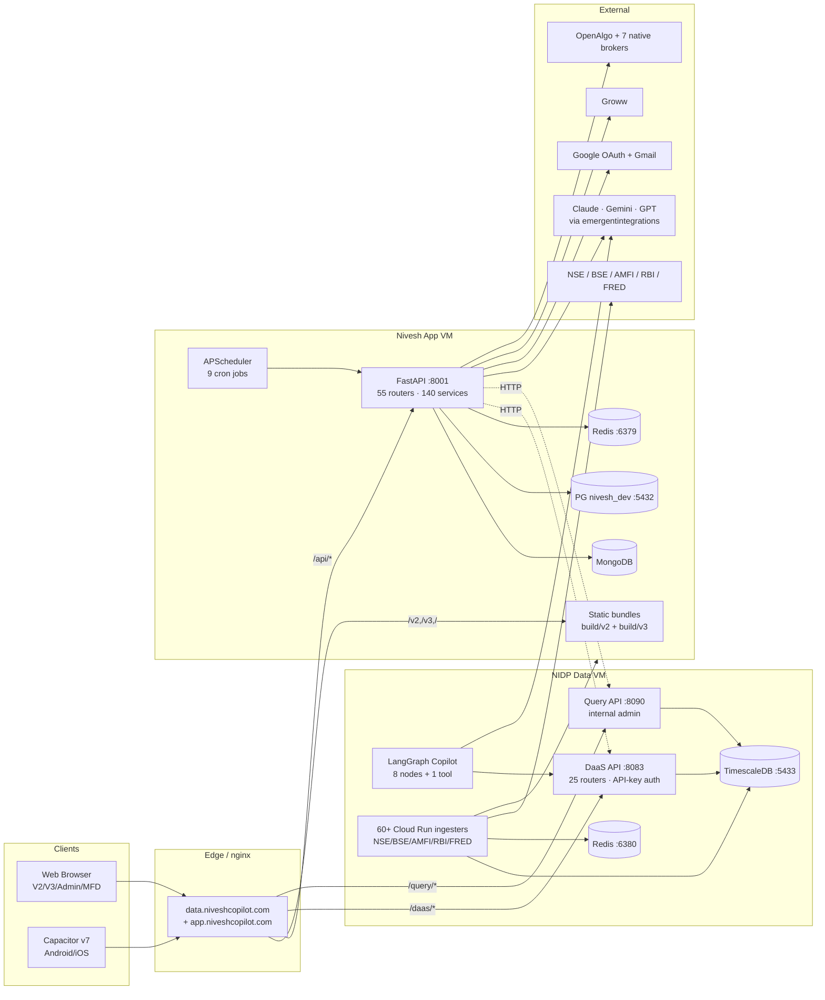

---

## 2. Frontend Architecture

### 2.1 Bundle layout (post-commit `774b4ef`)

Two **fully isolated** webpack builds from one source tree. Each ships its own `index.html`, JS chunk, asset paths. Both share Auth/Theme/NumberFormat contexts and Radix UI primitives.

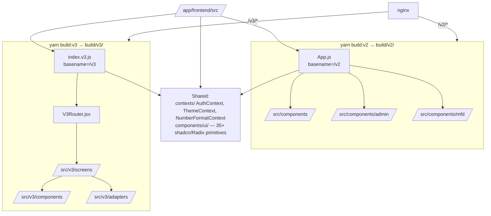

**Webpack DefinePlugin** replaces `REACT_APP_BUNDLE_TARGET` at build time; Terser dead-code-eliminates the other bundle. New V3 code cannot leak into V2 and vice versa.

### 2.2 V2 bundle (legacy Nivesh + Admin + MFD)

| Slice | Detail |
|---|---|
| **Stack** | React 19, React Router v7 (`basename="/v2"`), craco/webpack, Tailwind v3.4 + shadcn (Radix), Framer Motion, axios |
| **Build** | `yarn build:v2` → `REACT_APP_BUNDLE_TARGET=v2 PUBLIC_URL=/v2 BUILD_PATH=build/v2` |
| **Auth** | Google OAuth via session cookie (`withCredentials: true`), 30s timeout |
| **Top routes** | `/` Landing · `/cas-callback` · `/cas-connect/:token` · `/dashboard` · `/chat/:threadId` · `/nidp` (admin) · `/app` (NiveshV2 main) · `/v3/*` hard-redirects |

**Component domains:**

| Domain | Major components |
|---|---|
| **Onboarding** | `Landing.js`, `OnboardingView.js`, `OnboardingCopilotWrapped.jsx`, `CasConnect.jsx` (CDSL OTP) |
| **Dashboard** | `DashboardOverview.js`, `InsightsView.js` (95KB), `ActionablePortfolioView.js` (93KB) |
| **Portfolio** | `PortfolioView.js`, `RiskProfileView.js`, `PositionalPicks.jsx` |
| **Chat (Copilot V2)** | `ChatView.js` (77KB) — SSE streaming via `fetch().body.getReader()`; chart blocks via ` ```chart ` fences; AgentPicker + ModelPicker |
| **Admin (/nidp)** | `NidpConsole.jsx` → 11 tabs: NidpJobsPanel, NidpQualityDashboard, NidpBackfillPanel, NidpCatalogPanel, NidpDqAiPanel, DataPipelineMonitor, UserManagementSection, RulesConfigSection, FeatureFlagsSection, NidpGrafanaEmbed |
| **MFD Workspace** | `MfdDashboard.jsx`, `ClientSnapshot.jsx` (102KB), `CasTimeMachine.jsx` (44KB), `LiveEventFeed.jsx`, `MfdOnboardingWizard.jsx`, `SectorHeatmap.jsx`, `MacroBar.jsx`, `WeekendWatchlist.jsx` |
| **Other** | `TradeJournal.jsx`, `DataHealthBanner.jsx`, `MarketDashboard.jsx`, `BrokerConnectButton.jsx`, `FamilyView.js` |

### 2.3 V3 bundle (mobile-first, `/v3/*`)

| Slice | Detail |
|---|---|
| **Stack** | React 19, React Router v7 (`basename="/v3"`), craco/webpack, Tailwind + V3 CSS-var design tokens, Framer Motion, axios, Capacitor v7 |
| **Build** | `yarn build:v3` → isolated `build/v3/` |
| **Design tokens** | Scoped to `.v3` class — surfaces (`--v3-bg-0..3`), ink (`--v3-ink-1..4`), brand (saffron/indigo/moss/gold/crimson), category colours, radii, shadows, spacing |
| **Fonts** | Fraunces (display), Geist (body), Geist Mono (eyebrow) |
| **Top routes** | `/onboarding` (public) · `/home` (CopilotHome) · `/chat[/:threadId]` · `/dashboard` · `/portfolio[/diversification,/concentration]` · `/risk[/stress]` · `/tax` · `/performance` · `/advisor` · `/market` · `/settings` · `/profile` |
| **Gate** | All routes except `/onboarding` wrapped in `V3Protected` (checks `useAuth().user`) |

**Onboarding (10-second 4-step):** Welcome (1s) → Pick (CAS/Gmail/Manual) → Importing (4–5s findings stream: PAN → MF folios → equities → SIPs) → Reveal persona → bounce to `/home`. Sets `localStorage v3.onboarded="1"`.

**Adapters (no Redux):** `/src/v3/adapters/apiClient.js` returns `{data, error}` — never throws. Sub-adapters: `persona.js`, `portfolio.js`, `copilotChat.js` (sync `/api/copilot/ask`, not SSE), `promptCatalog.js`.

**Responsive:** `useBreakpoint()` → MobileShell (BottomNav, safe-area insets) vs DesktopShell (Sidebar). Capacitor wraps the same web bundle in WebView for Android/iOS.

### 2.4 Cross-cutting frontend concerns

- **State** — Context + localStorage only. No Redux, Zustand, react-query.
- **API client** — axios (`process.env.REACT_APP_BACKEND_URL/api`, `withCredentials: true`, 30s). V2 chat uses ReadableStream SSE; V3 uses sync POST.
- **Design system** — `/src/components/ui/` (35+ shadcn primitives) + V3 token CSS scoped to `.v3`. Dark mode via `class` strategy.
- **Path-prefix guard** — Each bundle checks `location.pathname` on load and hard-redirects if mismatched (so V2 never serves `/v3/*` paths and vice versa).
- **Code-splitting** — Lazy routes (Suspense + `React.lazy`) in both bundles.
- **Accessibility** — Radix defaults (keyboard, ARIA, focus).
- **No PWA** — no manifest.json, no service worker (yet).

---

## 3. Backend Architecture

### 3.1 Directory tree (3 levels)

```
/app/backend/
├── server.py                # FastAPI app + 55 routers + lifespan
├── deps.py                  # Shared deps: Mongo/PG/Redis clients, auth, RBAC
├── middleware.py            # CorrelationID · RequestLog · RateLimit · SecurityHeaders
├── repository.py · models.py · models_copilot_widgets.py
├── feature_flags.py · instruments_data.py
├── core/                    # logging_config · correlation · error_handlers · exceptions
├── helpers/                 # secrets · datastore_isolation · gsm · portfolio_utils · parsing · upload_validation
├── routes/                  # 55+ routers (see §3.3)
├── services/                # 140+ business logic modules (see §3.4)
│   ├── copilot_rag/         # V1 RAG: orchestrator · intent_router · retrievers · chart_specs
│   ├── copilot_tools/       # 13 tools (portfolio, mf, stock, technical, fundamental, risk, sip, recommendation, widget_builders, daas_client, ...)
│   ├── tax_engine_fifo/     # fifo_matcher · corporate_actions · harvesting · tax_calculator
│   ├── positional_engine/   # pipeline · scanner · feature_calculator · sector_strength · macro_overlay · scorer · backtest · trade_planner
│   ├── strategy_engine/     # dsl · compiler_stock · backtest
│   ├── feed_rag/            # orchestrator · registry · retrievers/{text,vector,structured} · subscriptions
│   └── brokers/             # base · registry · zerodha · upstox · dhan · angelone · fyers · aliceblue · fivepaisa
├── scripts/                 # fetch_amfi_navs.py, admin maintenance
├── tests/                   # 50+ pytest files
└── nidp/                    # Sub-application (see §4)
```

### 3.2 Request pipeline

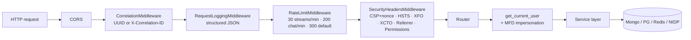

**Lifespan startup** (`server.py:189-255`): seed admin/whitelist → hydrate secrets/feature_flags/v3_weights from DB → start APScheduler → ensure indexes → enforce datastore isolation. **Shutdown**: stop scheduler, close PG pool, Redis, Mongo.

### 3.3 Routes — 55+ routers organised by domain

```mermaid
flowchart LR
    subgraph AUTH[Auth/User]
        A1[/api/auth]
        A2[/api/user]
    end
    subgraph PF[Portfolio]
        P1[/api/portfolio]
        P2[/api/portfolio/health]
        P3[/api/portfolio/snapshots]
        P4[/api/portfolio/exposure]
        P5[/api/portfolio/builder]
        P6[/api/portfolio/export]
    end
    subgraph CP[Copilot]
        C1[/api/copilot legacy]
        C2[/api/copilot/agents V2]
        C3[/api/copilot/prompts]
        C4[/api/copilot/widgets]
        C5[/api/chat stream]
        C6[/api/intelligence]
    end
    subgraph INT[Analytics/Intel]
        I1[/api/analytics]
        I2[/api/insights]
        I3[/api/goals]
        I4[/api/plans]
        I5[/api/scenarios]
        I6[/api/macro]
        I7[/api/market/events]
        I8[/api/benchmarks]
    end
    subgraph TR[Trading]
        T1[/api/positional]
        T2[/api/positional/journal]
        T3[/api/strategy]
        T4[/api/feeds]
    end
    subgraph DAT[Data import]
        D1[/api/upload]
        D2[/api/gmail]
        D3[/api/onboarding/gmail]
        D4[/api/cas/transactions]
        D5[/api/cas/snapshots]
        D6[/api/cas/invite + public]
        D7[/api/data/health]
        D8[/api/mf]
    end
    subgraph BR[Broker]
        B1[/api/broker/connect OpenAlgo]
        B2[/api/broker/native 7 brokers]
        B3[/api/openalgo proxy]
    end
    subgraph MF[MFD]
        M1[/api/mfd workspaces·profiles]
        M2[/api/advisor]
    end
    subgraph AD[Admin]
        AD1[/api/admin]
        AD2[/api/admin/users]
        AD3[/api/admin/v3/master · weights · stock]
        AD4[/api/admin/nidp · replay · backfill]
        AD5[/api/admin/swagger]
        AD6[/api/admin/datastores]
        AD7[/api/admin/rules]
        AD8[/api/admin/data-pipeline]
    end
    subgraph CMP[Compliance]
        CC1[/api/compliance DPDP]
    end
```

### 3.4 Service layer — 140+ modules

| Cluster | Key modules |
|---|---|
| **Copilot V1 (RAG)** | `copilot_rag/orchestrator.py` (intent → retrieval → prose), `intent_router.py`, `retrievers.py`, `chart_specs.py` |
| **Copilot tools** | `copilot_tools/`: portfolio, mf, stock_intelligence, technical, fundamental, risk, sip, recommendation, widget_builders, daas_client, mf_intelligence, company_financials, insight_card_transformers |
| **Portfolio engines** | `portfolio_health.py`, `portfolio_health_projection.py`, `portfolio_snapshot.py`, `portfolio_builder.py`, `portfolio_concentration.py`, `portfolio_enrichment.py`, `portfolio_intelligence.py` |
| **CAS / Tax** | `cas_parser.py`, `claude_cas_parser.py`, `openai_cas_parser.py`, `docling_cas_parser.py`, `hybrid_cas_parser.py`, `cas_transactions.py`, `cas_snapshot_engine.py`, `capital_gains_engine.py`, `tax_engine.py`, `tax_engine_fifo/{fifo_matcher,corporate_actions,harvesting,tax_calculator}.py` |
| **Scoring** | `v3_weights.py`, `v3_scoring.py`, `v3_explainer.py`, `stock_scoring.py`, `instrument_scoring.py`, `consolidation_score_engine.py`, `exit_score_engine.py`, `priority_engine.py` |
| **Decision engines** | `decision_engine.py`, `decision_engine_actions.py`, `switch_decision_engine.py`, `switch_simulator.py`, `redeploy_suggester.py`, `deviation_engine.py`, `duplicate_optimizer.py` |
| **Fund data** | `fund_data_resolver.py`, `fund_performance.py`, `fund_clusterer.py`, `candidate_fund_hydrator.py`, `mf_category_enricher.py`, `groww_client.py`, `groww_stock_scraper.py`, `groww_fundamentals.py`, `moneycontrol_client.py`, `morningstar_stock_client.py`, `tickertape_client.py` |
| **Goals** | `goal_engine.py`, `goal_copilot.py`, `goal_fund_picker.py`, `action_plan_manager.py` |
| **Positional engine** | `positional_engine/{pipeline,scanner,feature_calculator,sector_strength,macro_overlay,scorer,conviction,market_dashboard,nse_live,equity_universe,bhavcopy_ingester,ohlcv_store,chartink_api,backtest,trade_planner,portfolio_filter,scan_config}.py` |
| **Strategy + feeds** | `strategy_engine/{dsl,compiler_stock,backtest}.py`, `feed_rag/{orchestrator,registry,subscriptions}.py` + retrievers (text/vector/structured) |
| **Broker** | `brokers/{base,registry,zerodha,upstox,dhan,angelone,fyers,aliceblue,fivepaisa,_helpers}.py`, `openalgo_client.py`, `openalgo_instance_manager.py`, `openalgo_provisioner.py` |
| **Macro + NIDP bridge** | `macro_engine.py`, `macro_ingester.py`, `macro_sector.py`, `nidp_context.py`, `nidp_query_client.py`, `nidp_vm_query.py`, `nidp_vm_ssh.py` |
| **MFD + compliance** | `mfd_workspace.py` (impersonation), `identity_uniqueness.py`, `consents.py`, `audit.py`, `pii_security.py`, `llm_safety.py` |
| **Scheduling + ops** | `mf_scheduler.py` (APScheduler coordinator), `gmail_auto_import.py`, `pipeline_progress.py` |
| **Data access** | `pg_client.py` (asyncpg pool), `pg_writer.py`, `redis_client.py` |

### 3.5 Auth, RBAC, MFD impersonation

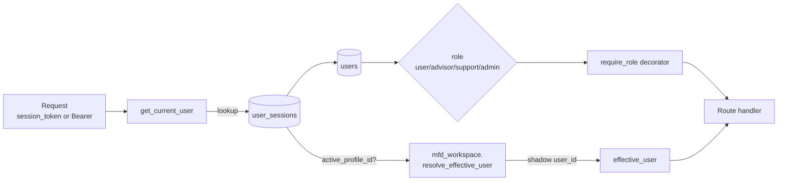

- **Sessions**: HTTP-only cookie or `Authorization: Bearer`. 30d expiry. Stored in Mongo `user_sessions`.
- **RBAC**: `users.role` (`user|advisor|support|admin`) replaces legacy `is_admin`. `require_role("admin")` dependency factory guards admin routes.
- **MFD impersonation**: when session has `active_profile_id`, all downstream queries run against the shadow `user_id` from `profiles.shadow_user_id`. Single code path serves retail + advisor.
- **Whitelist**: Google sign-in gated by `whitelisted_users` (seeded at startup).
- **Rate limiting** (in-memory sliding window): `/chat/stream` 30/min, `/chat/*` 200/min, others 300/min, `/chat/warmup` exempt.
- **Security headers**: CSP with per-request nonce, HSTS, X-Frame-Options DENY, no-sniff, Referrer-Policy, Permissions-Policy mic/camera/geo off.

---

## 4. NIDP Sub-Application

Separate FastAPI processes deployed independently. Shares the TimescaleDB warehouse and a GCS bucket but runs on its own VM with its own Redis.

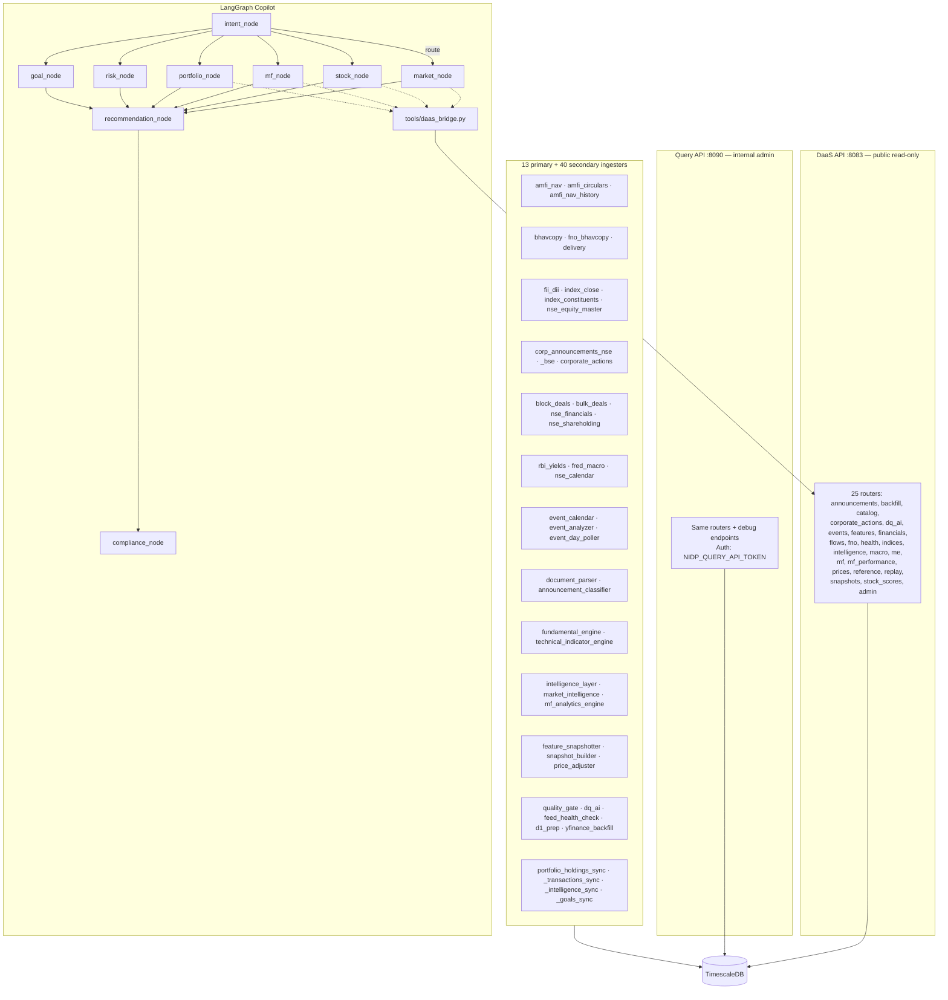

**Auth**: DaaS uses per-caller API keys (`python -m nidp.cli daas-keygen`) with per-key rate-limit quotas. Query API uses static `NIDP_QUERY_API_TOKEN` for the main backend.

**LangGraph specifics**: `nidp/services/copilot_agent/graph.py::build_graph()` compiles a `StateGraph[CopilotState]`. Routing after `intent_node` picks one specialist; all specialists feed `recommendation_node`; `compliance_node` is the final guard. Checkpointing via `MemorySaver`; `astream_events(version="v2")` for token streaming.

---

## 5. Copilot Architecture — Two Paths

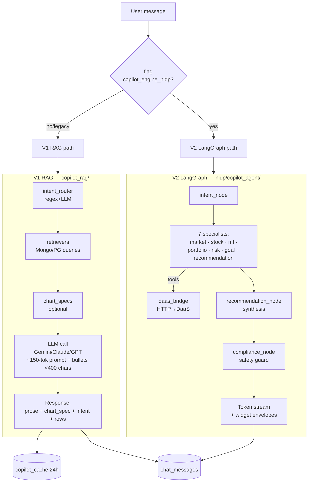

**Widget envelopes** (`models_copilot_widgets.py`): `fund_card`, `compare_table`, `insight_card`, `sip_plan`, `rebalance_plan`, `tax_harvest`, `market_brief`, `tech_analysis`, etc. — each carries `kind`, `title`, `freshness` (live/cached/delayed/eod/stale + last_updated + age_seconds), `data`, `partial` (streaming flag). Frontend renders kind-specific UI.

**Persona prompts**: `copilot_agents.route_intent(message)` → AgentSpec (auto / portfolio_analyzer / mf_research / market_strategist / tax_agent / compliance_agent / report_generator). Each AgentSpec carries triggers (regex) and default chip suggestions per persona (P1 catalog: 99 persona-tagged + 10 universal).

---

## 6. Scheduled Jobs (APScheduler `mf_scheduler.py`)

All jobs check `system_config.data_pipeline.paused` before executing. All wrap in try/except + log; failures never crash the scheduler.

```mermaid
gantt
    title APScheduler daily jobs (IST)
    dateFormat HH:mm
    axisFormat %H:%M
    section Market data
    macro_ingest (18:35)            :18:35, 10m
    amfi_navs (22:00)               :22:00, 20m
    analytics_sweep (22:30)         :22:30, 15m
    v3_rescore (22:45)              :22:45, 15m
    benchmark_refresh (23:15)       :23:15, 10m
    nifty100_refresh (00:00)        :00:00, 5m
    section User-side
    portfolio_snapshot (23:00)      :23:00, 15m
    gmail_auto_import (23:00)       :23:00, 30m
    section Scrapers
    stale_refresh (03:00)           :03:00, 5m
    drain_queue (02-06 hourly)      :02:00, 4h
```

| Job | Schedule | Function | Effect |
|---|---|---|---|
| `drain_queue` | hourly 02-06 IST weekdays, every 6h weekends | `fund_data_resolver.drain_queue(30)` | Pull 30 funds from Mongo `scrape_queue`, scrape Groww, upsert metadata |
| `stale_refresh` | 03:00 IST | Re-enqueue funds with `last_scraped_at > 15d` | Repopulates scrape_queue |
| `amfi_navs` | 22:00 IST | `scripts/fetch_amfi_navs.py::run()` | AMFI EOD CSV → Mongo + PG |
| `analytics_sweep` | 22:30 IST | `nav_analytics_sweep.run_analytics_sweep()` | Recompute returns / vol / Sharpe |
| `v3_rescore` | 22:45 IST | `nav_analytics_sweep.run_v3_rescore()` | Update PG `v3_composite_scores`; Redis `v3:score:{id}` invalidated |
| `portfolio_snapshot` | 23:00 IST | Snapshot each user's portfolio | Mongo `portfolio_snapshots` |
| `gmail_auto_import` | 23:00 IST | Fetch & parse CAS emails | Mongo `gmail_imports` |
| `benchmark_refresh` | 23:15 IST | `benchmark_index.refresh_all()` | PG `benchmark_indices` |
| `macro_ingest` | 18:35 IST | `macro_ingester.run()` | Daily regime + features |
| `nifty100_refresh` | 00:00 IST | Refresh NSE Nifty 100 universe | PG `equity_universe` |

---

## 7. External Integrations

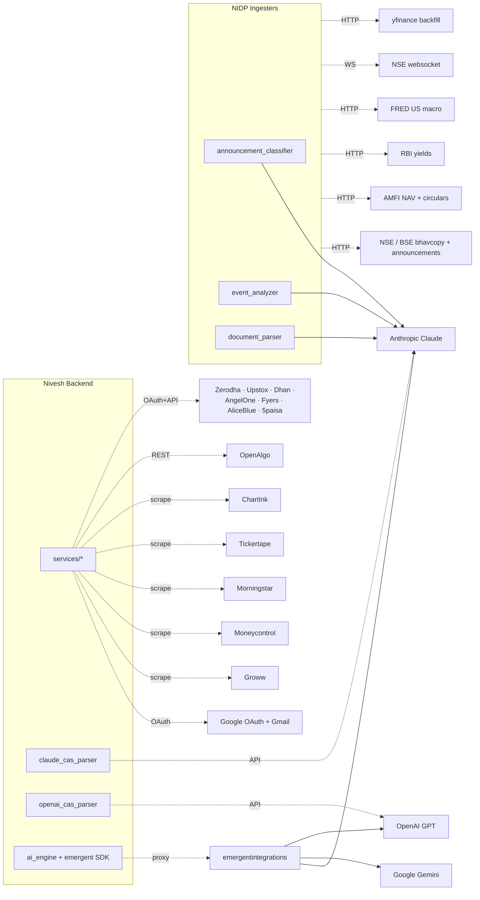

---

## 8. Deployment

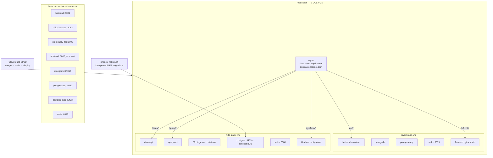

**nginx routing rules** (`backend/nidp/deploy/vm/nginx.conf` + app-server nginx):
- `/daas/*` → `127.0.0.1:8083`
- `/query/*` → `127.0.0.1:8090`
- `/grafana/*` → `127.0.0.1:3000` (subpath)
- `/health` → 200 (liveness, no upstream)
- `/v2/*` → `build/v2/index.html` + `/v2/static/*`
- `/v3/*` → `build/v3/index.html` + `/v3/static/*`
- `/api/*` → backend FastAPI

**Containers (prod):** 4 service accounts, ~$42–60/mo total. See [GCP_DEPLOYMENT_GUIDE.md](GCP_DEPLOYMENT_GUIDE.md) and [POST_DEPLOY_MIGRATION.md](POST_DEPLOY_MIGRATION.md).

---

## 9. Cross-cutting Concerns

| Concern | Implementation |
|---|---|
| **Logging** | Structured JSON via `core/logging_config.py`; correlation_id propagated via `core/correlation.py`; loggers: `nivesh`, `nivesh.access`, `nidp.*` |
| **Error handling** | Global FastAPI handlers in `core/error_handlers.py`; custom exceptions in `core/exceptions.py`; correlation_id included in every error response |
| **Config / secrets** | Admin-managed: `system_config` Mongo doc holds secrets, feature_flags, v3_weights, cas_parser settings — hot-reloadable without redeploy. `helpers/gsm.py` for GCP Secret Manager on production. |
| **Feature flags** | `feature_flags.py` hydrated from DB at startup; key flags: `copilot_engine_nidp`, `copilot_persona_prompts_enabled` (default on), `plan_generation_enabled` |
| **Datastore isolation** | `helpers/datastore_isolation.enforce_isolation_at_startup()` — verifies Mongo/PG/Redis are not shared between prod and preview; hard-fails on prod, warns on preview |
| **Graceful degradation** | All external clients (Groww/NIDP/Redis/LLMs) wrapped in try/except → fallback to cache or no-op rather than crash request |
| **Testing** | pytest under `/backend/tests/` (50+ files); test categories: portfolio health, copilot phases A/B, V3 explainer, MFD impersonation, CAS parsing, tax engine, positional engine |
| **Tech versions** | Python 3.12 (compile) / 3.11 (Docker), FastAPI 0.110.1, Pydantic 2.12.5, Motor 3.3.1, asyncpg 0.31, redis 7.4, APScheduler 3.11.2, LangChain 1.4 + LangGraph 1.2, OpenAI 1.99, google-genai 1.71, casparser 0.8.1, pymupdf 1.24.14, polars 1.39, pandas 3.0.2 |

---

## 10. End-to-end flows

### 10.1 CAS upload → dashboard

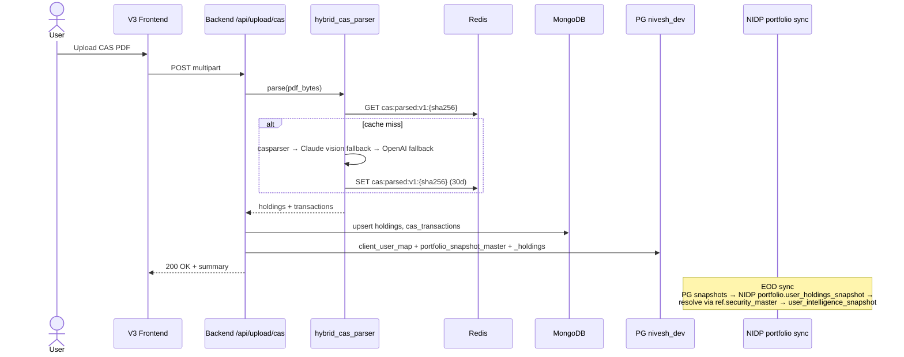

### 10.2 Copilot chat turn (V2 LangGraph)

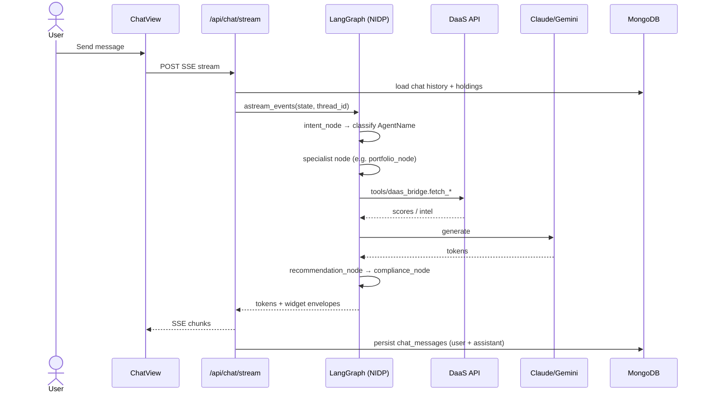

### 10.3 Action plan generation

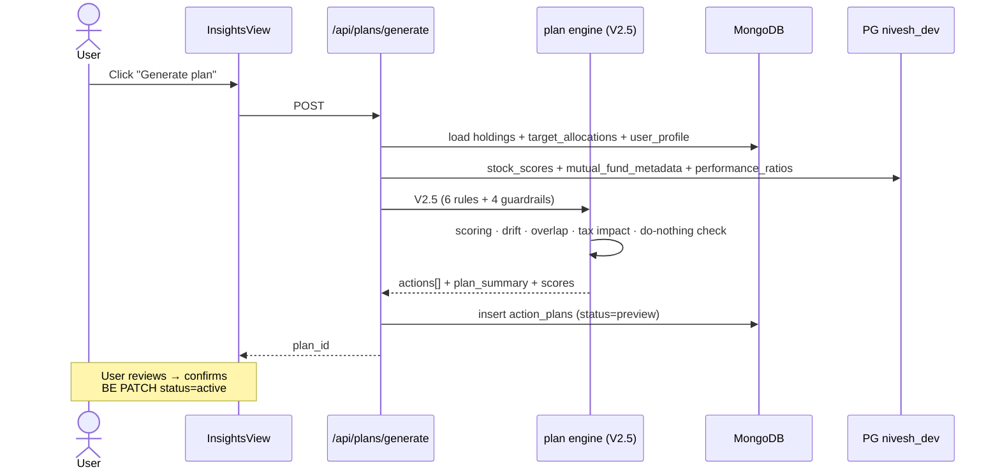

---

## 11. Known gaps & active work

From memories and recent commits:
- **NIDP↔Copilot ownership**: `equity_pct`, `beta`, `top_sector` still duplicated in Copilot logic; `/v1/intelligence/portfolio/{user_id}/snapshot` endpoint exists but unwired (see `project_nidp_copilot_ownership`).
- **Consolidation/exit scoring** shipped on PR #39 but `winner_pick_pending=True` — needs NIDP data-lake green before UI surfacing.
- **CAS parser** rotating key pool validated in prod (Admin → Secrets → CASPARSER_API_KEYS, hot-reloaded).
- **V3 isolation** completed in `774b4ef` — V2 and V3 are now fully separate webpack bundles with clean `/v3/*` URLs.
- **Persona-aware prompts (P1)** live: 99 persona-tagged + 10 universal, 5-category taxonomy, flag `copilot_persona_prompts_enabled`.
- **Volatility/beta** bug (NIDP migration 060) resolved 2026-05-20.

Open tasks tracked in [TASK_REGISTRY.md](TASK_REGISTRY.md): TASK-077–082, 084–086, Epic 10 (security).
