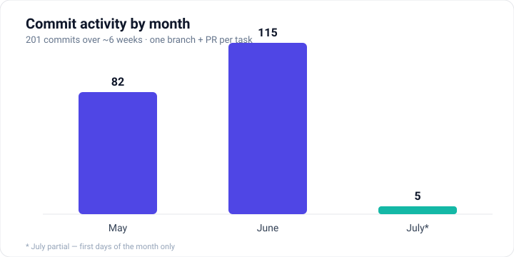
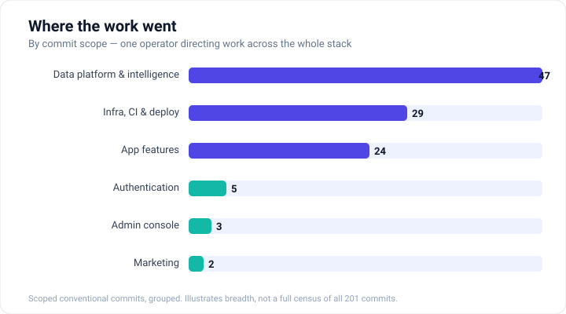
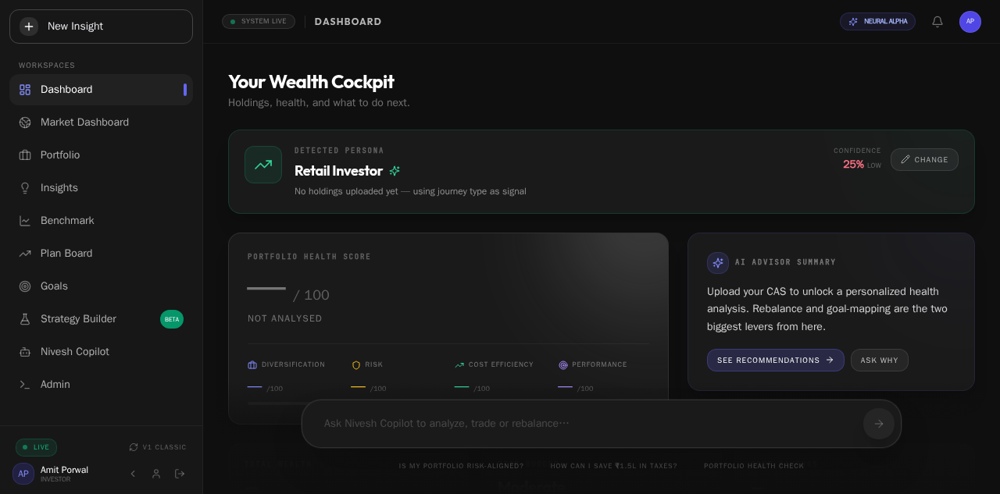

# Building Nivesh.ai with Claude: what an AI copilot actually changed

*A field report from shipping an AI wealth-management platform for Indian retail investors — with Claude Code as a daily collaborator, not a demo.*

---

## The setup

Nivesh.ai is not a weekend project. It's two independently deployable systems:

- **The Nivesh Application** — a user-facing investing copilot with portfolio, plans, and goals, built on React 19, FastAPI, MongoDB, PostgreSQL, Redis, and a LangGraph agent with nine specialist nodes.
- **NIDP (the Nivesh Indian Data Platform)** — an isolated data lake and API platform that ingests 41 Indian market-data feeds through 28 Cloud Run ingesters, backed by TimescaleDB, Redpanda, Prometheus/Grafana/Loki, and MinIO.

That's a lot of surface area for a small team: React front-ends (three generations of them), a Python async backend, two Postgres-flavored data stores, a Kafka-compatible event bus, GCP infrastructure across Cloud Run / Cloud Build / Secret Manager, and a mobile build on top. The kind of stack where the bottleneck is rarely *ideas* — it's the hours it takes to safely touch that many moving parts without breaking something.

That's where Claude came in.

*Six weeks, 201 commits, every task on its own branch and PR — a pace a small team shouldn't be able to sustain on a stack this wide.*

## Not "AI writes code" — AI works inside guardrails we designed

The most important decision we made was to treat Claude less like an autocomplete and more like a team member who reports to a very strict process. We built that process directly into the repo, in a `.claude/` directory and a set of context files that load at the start of every session.

The centerpiece is a **task-intake protocol**. Before Claude touches anything, it has to classify the work and load the matching role guide — full-stack developer, QA engineer, product manager, design engineer, or project manager — and then apply the union of their guardrails. Each role carries its own Definition of Done. A UI task loads the design-engineer checklist; a schema change loads the DB-migration checklist. It forces the same "what discipline does this actually need?" question a good senior engineer asks before writing a line.

On top of that sits a set of **non-negotiable honesty rules** — and this is the part that made Claude trustworthy rather than merely fast:

- *"Changed" is not "verified."* Edited code is treated as a hypothesis until a real command proves it.
- *No conclusion-words without evidence in the same breath.* Claude isn't allowed to say "fixed," "working," or "done" unless that same message contains the command it ran and the real, unedited output.
- *Mock data is loud or it's a lie.* Any stub is labeled in the code and called out in prose — never presented as a real result.
- *Report failures, don't paper over them.* A test that fails gets shown failing.

These aren't suggestions living in a README that everyone ignores. They're enforced by **hooks** — a `Stop` hook literally blocks a session that edited code from ending until a verification command has actually run. The machine won't let the work be declared finished on vibes.

The lesson: an AI collaborator is only as good as the environment you put it in. Spend the time to encode your standards, and the tool inherits them.

## What actually got shipped

Over roughly six weeks and 200+ commits, Claude worked across nearly every layer of the stack.

A representative slice, straight from the merge history:

- **Authentication end to end** — email OTP sign-in for whitelisted accounts, self-serve magic-link email validation, dropping a Gmail-only gate so any valid domain works, plus a local Mailpit dev-SMTP setup and staging provisioning so the flow was actually testable.
- **A mobile app** — a production Capacitor 7 Android build wired into CI to publish the APK, including the unglamorous debugging of `scp` staging directories and streaming the artifact over an ssh exec channel when the off-the-shelf action failed.
- **Data-driven dashboards** — an International Funds dashboard built against the proper NIDP schema and price feed, and a homepage that binds a *real* health score instead of a hardcoded placeholder.
- **A document pipeline** — making CAS (Consolidated Account Statement) PDF upload work through an in-house server-side parser, and fixing a nasty 500 that hit *every* file upload because of a reserved `filename` key colliding with Python's `LogRecord`.
- **A portfolio selection framework** — the instrument-selection engine behind the Portfolio Builder.
- **A V5 redesign** — a reworked login and home experience.

*One of the dashboards — real market data flowing from NIDP into the user-facing app, not placeholder numbers.*

Two things stand out about that list. First, the *range*: front-end redesigns, backend bug fixes, CI plumbing, mobile builds, and data-platform work, often in the same week. Second, the *nature of the wins* — a lot of it is exactly the tedious, high-context, easy-to-get-wrong work that eats a small team's time. The `filename`/`LogRecord` collision is the perfect example: a single reserved-key mistake breaking all uploads, the kind of bug that costs an afternoon of confused debugging and gets fixed in minutes once you know where to look.

## Where the productivity actually came from

If I had to name the mechanisms, not the marketing:

**Context that doesn't evaporate.** The `docs/` folder is treated as the source of truth — architecture, API, schema, environments, deployment — and Claude is told to read the owner of a fact rather than guess it. That means a change to the database starts by reading `DATABASE_SCHEMA.md`, and a claim about the feed pipeline gets checked against the real feed-status views. The AI holds the whole system in context in a way no single human on a busy day reliably does.

**The verification tax, paid automatically.** The honesty rules turned "it should work" into "here's the command and its output." That sounds like friction, but it's the opposite: it front-loads the debugging that would otherwise surface in production. "App AND data testing" — the code runs *and* the data it produced is real and correct — became the default bar, not an aspiration.

**Parallel disciplines from one operator.** The role system let one person direct product-manager thinking, then design-engineer thinking, then QA thinking on the same feature, without context-switching cost. There's even a multi-agent team setup (`/plan-from-prd`, `/team`) for decomposing a PRD across role subagents with a shared workspace.

**Branch-per-task hygiene.** Every Claude-driven change landed on its own branch and PR — `claude/magic-link-email-validation`, `claude/nivesh-android-capacitor`, and so on — which kept the work reviewable and reversible. Nothing got shoved to `main` in the dark.

## What it didn't do

Honesty is the whole point of how we ran this, so: Claude didn't replace judgment. The intake protocol, the role definitions, the honesty hooks, the doc structure — a human designed all of that, and a human decided what was worth building and when something was actually right. When Claude hit a real blocker, the process demanded it *stop and say so* rather than route around it with a plausible-looking fake. That discipline is what made the speed safe. Fast and wrong would have been worse than slow.

## The takeaway

The headline isn't "AI wrote our app." It's that a genuinely complex, multi-system financial product got built and iterated on by a small team at a pace that a small team shouldn't be able to sustain — because a well-instructed AI collaborator absorbed an enormous amount of the high-context, verification-heavy, cross-layer grunt work, inside guardrails that kept it honest.

The productivity gain wasn't magic. It was the compounding of a hundred afternoons not lost to reserved-key bugs, `scp` misconfigurations, schema mismatches, and "wait, did that actually deploy?" The tool was Claude. The multiplier was the process we built around it.

---

*Nivesh.ai — an AI-powered wealth-management copilot for Indian retail investors.*
