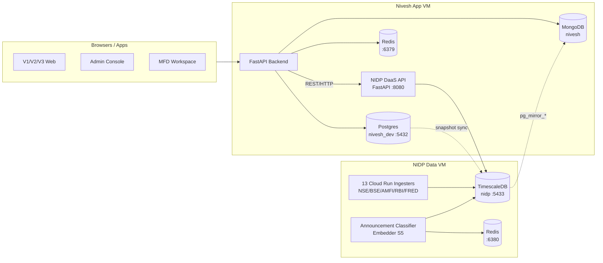
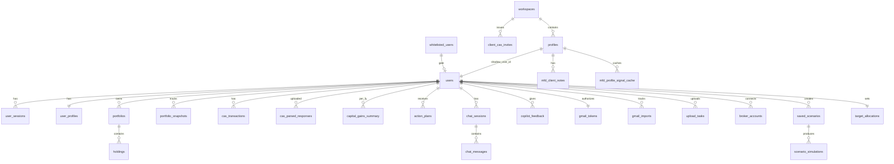
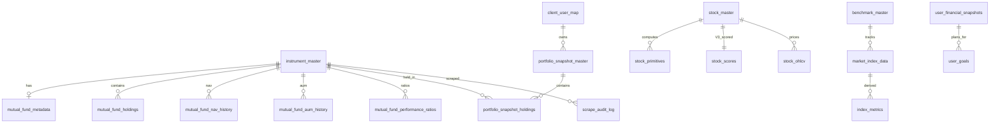
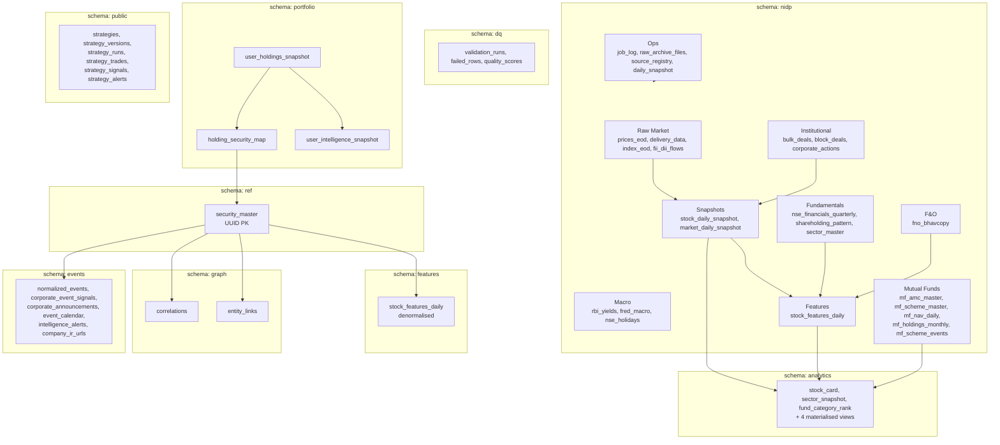

# DB Architecture — Nivesh.ai + NIDP

Complete persistence-layer reference covering all four datastores:

1. **MongoDB** (Nivesh) — user state, chat, plans, OAuth tokens
2. **Postgres `nivesh_dev` :5432** — instrument master, V3 scoring, goal planning, portfolio snapshots
3. **NIDP TimescaleDB :5433** — market intelligence warehouse (7 schemas, 100+ tables)
4. **Redis :6379/:6380** — shared cache (no streams/queues)

> Companion to [SCHEMA_DIAGRAM.md](SCHEMA_DIAGRAM.md) which lists NIDP migrations in build order. This document is the cross-DB reference and ER map.

---

## 1. Cross-DB Topology

**Key:**
- **MongoDB** — mutable user state (document-shaped)
- **Postgres `nivesh_dev` :5432** — analytics + snapshot store (raw asyncpg, no SQLAlchemy/Alembic; migrations are raw SQL under `/backend/migrations/`)
- **NIDP TimescaleDB :5433** — market intelligence warehouse
- **Redis** — shared L1 cache; errors never block (always falls back to Mongo → Postgres)

---

## 2. MongoDB (Nivesh) — 14 Domains, ~45 Collections

| Domain | Collections | Purpose |
|---|---|---|
| **Auth** | `users`, `user_sessions`, `whitelisted_users` | Identity, bearer tokens, beta gate |
| **Profile** | `user_profiles`, `target_allocations` | Risk profile, goals, desired allocation |
| **Portfolio** | `portfolios`, `holdings`, `portfolio_snapshots` | Multi-portfolio (Self/Spouse/Child), positions, history |
| **CAS / Tax** | `cas_transactions`, `cas_parsed_responses`, `capital_gains_summary` | NSDL/CDSL parsing, LTCG/STCG (FIFO) |
| **Action Plans** | `action_plans`, `pending_actions` | V2.5 engine (6 rules + 4 guardrails); preview→active→completed |
| **Copilot** | `chat_sessions`, `chat_messages`, `copilot_cache`, `copilot_feedback`, `copilot_chart_invalid` | Multi-turn chat with widget envelopes |
| **Gmail** | `gmail_tokens`, `gmail_oauth_states`, `gmail_success_codes`, `gmail_imports` | OAuth (AES-256-GCM), auto-import daemon |
| **Broker** | `broker_accounts`, `broker_oauth_states` | OpenAlgo + Zerodha/Fyers sync |
| **Uploads** | `upload_tasks` | CAS PDFs, CSVs |
| **MFD** | `workspaces`, `profiles`, `mfd_client_notes`, `mfd_profile_signal_cache`, `client_cas_invites` | Advisor multi-tenant + client invite tokens |
| **Scenarios** | `saved_scenarios`, `scenario_simulations` | What-if analyzer |
| **Caches** | `fund_holdings_cache`, `fund_performance_cache`, `international_funds_cache`, `stock_fundamentals_cache`, `portfolio_analysis_cache`, `portfolio_analysis_deep`, `allocation_analysis_cache`, `ai_insights` | Tier-2 cache (Redis→Mongo→Postgres) |
| **Mirror** | `pg_mirror_instrument_master`, `pg_mirror_mutual_fund_metadata`, `pg_mirror_mutual_fund_performance_ratios`, `pg_mirror_meta` | One-way replication from Nivesh Postgres |
| **Admin** | `system_config`, `openalgo_instances`, `audit_log`, `consent_records`, `mf_master`, `detected_sips` | Feature flags, audit, MF master mirror |

---

## 3. Postgres `nivesh_dev` (port 5432) — Analytics + Snapshot Store

| Category | Tables |
|---|---|
| **Instrument Master** | `instrument_master` (UUID PK), `stock_master` (nse_symbol PK) |
| **Portfolio Snapshots** | `portfolio_snapshot_master`, `portfolio_snapshot_holdings`, `client_user_map` |
| **MF Analytics** | `mutual_fund_metadata`, `mutual_fund_holdings`, `mutual_fund_nav_history`, `mutual_fund_aum_history`, `mutual_fund_performance_ratios` |
| **Equity Scoring (V3)** | `stock_primitives`, `stock_scores` (BUY/HOLD/TRIM/EXIT/REVIEW + JSONB components), `stock_ohlcv` |
| **Goal Planning** | `user_financial_snapshots`, `user_goals` (Monte Carlo allocation + simulations) |
| **Benchmarks** | `benchmark_master`, `market_index_data`, `index_metrics` |
| **Audit** | `scrape_audit_log`, `amfi_nav_fetch_log` |

---

## 4. NIDP TimescaleDB (port 5433) — 7 Schemas, 100+ Tables

### 4.1 Schema overview

### 4.2 Hypertables (TimescaleDB)

| Hypertable | Time col | Chunk | Compression | Cardinality |
|---|---|---|---|---|
| `nidp.prices_eod` | as_of_date | 1mo | ≥90d, by symbol | 125k rows/day |
| `nidp.delivery_data` | as_of_date | 1mo | ≥90d, by symbol | 125k rows/day |
| `nidp.index_eod` | as_of_date | 3mo | ≥90d, by index | 25k rows/day |
| `nidp.fii_dii_flows` | as_of_date | 3mo | ≥90d | 5k rows/day |
| `nidp.bulk_deals` / `block_deals` | as_of_date | 3mo | — | variable |
| `nidp.rbi_yields` | as_of_date | 6mo | ≥180d | 1.5k rows/day |
| `nidp.fred_macro` | as_of_date | 6mo | ≥90d, by series | 2k rows/day |
| `nidp.nse_financials_quarterly` | period_end | 1yr | ≥90d, by symbol | 2k rows/yr |
| `nidp.shareholding_pattern` | period_end | 1yr | ≥90d, by symbol | 2k rows/yr |
| `nidp.fno_bhavcopy` | as_of_date | 1mo | ≥90d, by ticker | **2.5M rows/day** |
| `nidp.stock_daily_snapshot` | as_of_date | 1mo | — | 125k rows/day |
| `nidp.market_daily_snapshot` | as_of_date | 6mo | — | 250 rows/yr |
| `nidp.stock_features_daily` | as_of_date | 1mo | ≥90d, by symbol | 125k rows/day |
| `nidp.mf_nav_daily` | nav_date | 90d | ≥90d, by scheme | 2.5M rows/yr |

### 4.3 Key views & functions

- `v_stock_fundamentals_latest`, `v_shareholding_latest` — latest + QoQ/YoY deltas
- `v_options_chain_latest` — most-recent (ticker, expiry) chain
- `v_nifty500_daily`, `v_nifty50_daily`, `v_announcements_recent`, `v_announcements_high_impact_today`
- `analytics.refresh_all(p_date)` — nightly orchestration (stock_card → sector_snapshot → 4 MVs)
- `populate_stock_features_extended()` / `populate_stock_price_features()` / `refresh_stock_features()`

---

## 5. Redis — Shared L1 Cache

| Key pattern | Type | TTL | Producer → Consumer |
|---|---|---|---|
| `nivesh:mf:holdings:{instrument_key}` | JSON | 15d | fund_data_resolver → portfolio endpoints |
| `nivesh:mf:slug:{instrument_key}` | string | 15d | resolver → resolver |
| `v3:score:{instrument_id}` | JSON | 24h | portfolio_enrichment → /api/portfolio/enrichment |
| `pipeline:progress:{job}` | JSON | 3h running / 10m done | sweep workers → admin /status |
| `cas:parsed:v1:{sha256}` | JSON | 30d | hybrid_cas_parser → CAS upload flow |
| `benchmark:latest:{index_name}` | JSON | 1h | benchmark_index (yfinance) → /api/index/latest |
| `benchmark:map:{category}` | JSON | 24h | benchmark_index → classification |
| `nivesh:nidp:market_ctx` | string | 10m | nidp_context (DaaS fetch) → Copilot prompt |
| `chat_ctx:intel:{user_id}` | JSON | 5m | /api/chat → AI engine |
| `enriched_portfolio:{user_id}` | JSON | 5m | enrichment → dashboard |
| `nivesh:cache:{key}` | JSON | 300s default | generic |

**Deployment:** Redis 7-alpine, `512MB allkeys-lru --appendonly no`. Local dev shares one instance; prod has separate Redis on Nivesh-VM (6379) and NIDP-VM (6380). Pure cache layer — no pub/sub, streams, queues, or sorted-set operations.

---

## 6. Data Ownership

| Domain | Owner | Notes |
|---|---|---|
| User auth, sessions, OAuth tokens | **MongoDB** | Encrypted at rest (AES-256-GCM for Gmail/broker tokens) |
| Live holdings, chat, plans, MFD client invites | **MongoDB** | Mutable user state |
| Instrument master, V3 scoring, goal sims | **PG nivesh_dev** | Analytics workhorse |
| Historical portfolio snapshots | **PG nivesh_dev** → synced to NIDP `portfolio.*` | Two-tier persistence |
| Market data, fundamentals, MF NAV/holdings, events, F&O | **NIDP TimescaleDB** | Single source of truth — Copilot must NOT recompute |
| Document embeddings (pgvector RAG) | **NIDP TimescaleDB** | S5 announcement embedder |
| Hot cache for everything above | **Redis** | Tier-1; never authoritative |

---

## 7. Cross-DB Entity-Relationship Map

This is the master ER showing how documents and rows correlate **across** all three databases. Cross-DB links are not enforced by referential integrity — they are application-level joins keyed on natural identifiers (user_id, email, ISIN, NSE symbol, AMFI scheme_code).

### 7.1 Full cross-DB ER diagram

```mermaid
erDiagram
    %% =========================
    %% MongoDB (Nivesh)
    %% =========================
    mongo_users {
        string user_id PK
        string email UK
        string role
        string risk_profile
    }
    mongo_portfolios {
        string portfolio_id PK
        string user_id FK
        string member_name
        string relationship
    }
    mongo_holdings {
        string holding_id PK
        string user_id FK
        string portfolio_id FK
        string ticker "ISIN or NSE symbol"
        string asset_type
        float quantity
        float buy_price
        date buy_date
    }
    mongo_cas_transactions {
        string user_id FK
        string isin
        string scheme_name
        date date
        string type
        float units
        float amount
    }
    mongo_action_plans {
        string plan_id PK
        string user_id FK
        string status
        array actions "asset_name, type, amount"
    }
    mongo_chat_sessions {
        string session_id PK
        string user_id FK
    }
    mongo_chat_messages {
        string message_id PK
        string session_id FK
        string user_id FK
        array widgets
    }
    mongo_workspaces {
        string workspace_id PK
        string owner_user_id FK
        string type "INDIVIDUAL/ADVISORY"
    }
    mongo_profiles {
        string profile_id PK
        string workspace_id FK
        string shadow_user_id FK
        string type "SELF/CLIENT"
    }
    mongo_client_cas_invites {
        string invite_token PK
        string workspace_id FK
        string profile_id FK
    }
    mongo_pg_mirror_instrument_master {
        string isin
        string symbol
        string instrument_type
    }

    %% =========================
    %% Postgres nivesh_dev (5432)
    %% =========================
    pg_instrument_master {
        uuid instrument_id PK
        string isin UK
        string symbol
        string instrument_type
    }
    pg_stock_master {
        string nse_symbol PK
        string isin
        string sector
        bool is_nifty_100
    }
    pg_client_user_map {
        string client_id PK "= mongo user_id"
        string email UK
    }
    pg_portfolio_snapshot_master {
        uuid id PK
        string client_id FK
        date snapshot_date
    }
    pg_portfolio_snapshot_holdings {
        uuid id PK
        uuid snapshot_id FK
        uuid instrument_id FK
        float units
        float current_value
    }
    pg_stock_scores {
        string nse_symbol PK
        date as_of_date
        float quality_score
        float health_score
        string recommendation
    }
    pg_mutual_fund_metadata {
        uuid instrument_id PK
        float nav
        float expense_ratio
        string category
    }
    pg_user_goals {
        uuid goal_id PK
        uuid user_id FK
        string goal_type
        float target_amount_rs
    }

    %% =========================
    %% NIDP TimescaleDB (5433)
    %% =========================
    nidp_security_master {
        uuid security_id PK
        string entity_type
        string symbol
        string isin UK
        string nse_symbol
        string amfi_scheme_code
    }
    nidp_user_holdings_snapshot {
        uuid snapshot_id PK
        string external_user_id "= mongo user_id"
        date snapshot_date
        string isin
        string amfi_scheme_code
    }
    nidp_holding_security_map {
        uuid map_id PK
        uuid snapshot_id FK
        uuid security_id FK
        int match_confidence
    }
    nidp_user_intelligence_snapshot {
        uuid intelligence_id PK
        string external_user_id
        float equity_weight_pct
        string top_sector
    }
    nidp_prices_eod {
        date as_of_date
        string symbol
        float close_price
    }
    nidp_mf_scheme_master {
        string scheme_code PK
        string isin_growth
        string scheme_category
    }
    nidp_mf_nav_daily {
        string scheme_code FK
        date nav_date
        float nav
    }
    nidp_corporate_announcements {
        string announcement_id PK
        string ticker_symbol
        string isin
        string event_category
    }

    %% =========================
    %% Intra-Mongo
    %% =========================
    mongo_users ||--o{ mongo_portfolios : "user_id"
    mongo_portfolios ||--o{ mongo_holdings : "portfolio_id"
    mongo_users ||--o{ mongo_cas_transactions : "user_id"
    mongo_users ||--o{ mongo_action_plans : "user_id"
    mongo_users ||--o{ mongo_chat_sessions : "user_id"
    mongo_chat_sessions ||--o{ mongo_chat_messages : "session_id"
    mongo_users ||--o{ mongo_workspaces : "owner_user_id"
    mongo_workspaces ||--o{ mongo_profiles : "workspace_id"
    mongo_profiles ||--|| mongo_users : "shadow_user_id"
    mongo_workspaces ||--o{ mongo_client_cas_invites : "workspace_id"

    %% =========================
    %% Intra-PG nivesh_dev
    %% =========================
    pg_client_user_map ||--o{ pg_portfolio_snapshot_master : "client_id"
    pg_portfolio_snapshot_master ||--o{ pg_portfolio_snapshot_holdings : "snapshot_id"
    pg_instrument_master ||--o{ pg_portfolio_snapshot_holdings : "instrument_id"
    pg_instrument_master ||--o| pg_mutual_fund_metadata : "instrument_id"
    pg_stock_master ||--|| pg_stock_scores : "nse_symbol"

    %% =========================
    %% Intra-NIDP
    %% =========================
    nidp_user_holdings_snapshot ||--|| nidp_holding_security_map : "snapshot_id"
    nidp_security_master ||--o{ nidp_holding_security_map : "security_id"
    nidp_security_master ||--o{ nidp_prices_eod : "nse_symbol"
    nidp_mf_scheme_master ||--o{ nidp_mf_nav_daily : "scheme_code"

    %% =========================
    %% CROSS-DB LINKS (app-level joins)
    %% =========================
    mongo_users ||..o| pg_client_user_map : "user_id = client_id"
    mongo_users ||..o{ pg_user_goals : "user_id"
    mongo_users ||..o{ nidp_user_holdings_snapshot : "user_id = external_user_id"
    mongo_users ||..o{ nidp_user_intelligence_snapshot : "user_id = external_user_id"
    mongo_holdings }o..|| pg_instrument_master : "ticker = isin/symbol"
    mongo_holdings }o..|| pg_stock_master : "ticker = nse_symbol"
    mongo_holdings }o..|| nidp_security_master : "ticker = isin/nse_symbol"
    mongo_cas_transactions }o..|| pg_instrument_master : "isin"
    mongo_cas_transactions }o..|| nidp_mf_scheme_master : "isin = isin_growth"
    pg_instrument_master ||..|| nidp_security_master : "isin"
    pg_stock_master ||..|| nidp_security_master : "nse_symbol"
    pg_instrument_master ||..o{ mongo_pg_mirror_instrument_master : "async mirror"
    mongo_action_plans }o..o{ pg_instrument_master : "actions[].asset_name → resolve"
    nidp_corporate_announcements }o..|| nidp_security_master : "isin/ticker_symbol"
```

**Diagram legend:**
- `||--o{` — hard FK relationship (enforced within the same DB)
- `||..o{` / `||..||` — soft cross-DB join (application-level)

### 7.2 Cross-DB join table — the canonical keys

Every cross-DB relationship in the platform reduces to one of six natural keys:

| Natural key | Mongo carrier | PG `nivesh_dev` carrier | NIDP carrier |
|---|---|---|---|
| **user_id** | `users.user_id` (PK) | `client_user_map.client_id`; `user_goals.user_id`; `user_financial_snapshots.user_id` | `portfolio.user_holdings_snapshot.external_user_id`; `portfolio.user_intelligence_snapshot.external_user_id` |
| **email** | `users.email` | `client_user_map.email` | — |
| **ISIN** | `holdings.ticker` (when MF); `cas_transactions.isin` | `instrument_master.isin`; `mutual_fund_metadata` (via instrument_id) | `ref.security_master.isin`; `nidp.mf_scheme_master.isin_growth`; `nidp.shareholding_pattern.isin` |
| **NSE symbol** | `holdings.ticker` (when equity) | `stock_master.nse_symbol`; `stock_scores.nse_symbol` | `ref.security_master.nse_symbol`; `nidp.prices_eod.symbol`; `nidp.stock_daily_snapshot.symbol`; `nidp.stock_features_daily.symbol` |
| **AMFI scheme code** | `mf_master._id` (when populated) | `mutual_fund_metadata.amfi_scheme_code` | `nidp.mf_scheme_master.scheme_code` (PK); `ref.security_master.amfi_scheme_code` |
| **index name** | `pg_mirror_*` (when mirrored) | `benchmark_master.benchmark_symbol`; `market_index_data.index_symbol` | `nidp.index_eod.index_name`; `mf_benchmark_master.index_code` |

### 7.3 Critical join paths (read-flow walkthroughs)

| Read flow | Hop 1 | Hop 2 | Hop 3 | Hop 4 |
|---|---|---|---|---|
| **Dashboard: enrich a user's holdings** | Mongo `holdings` by `user_id` | PG `instrument_master` by `holdings.ticker = isin` OR PG `stock_master` by `nse_symbol` | PG `stock_scores` / `mutual_fund_metadata` for V3 score | Redis `v3:score:{instrument_id}` cached |
| **Action plan generation** | Mongo `holdings` + `target_allocations` | PG `mutual_fund_holdings` for overlap | PG `mutual_fund_performance_ratios` for risk | Write Mongo `action_plans` |
| **Tax (LTCG/STCG)** | Mongo `cas_transactions` by `user_id` (FIFO) | PG `instrument_master` to resolve scheme | Write Mongo `capital_gains_summary` | — |
| **Copilot chat with market context** | Mongo `users` + `holdings` for portfolio framing | Redis `nivesh:nidp:market_ctx` (10m TTL) | NIDP DaaS `/v1/intelligence/portfolio/snapshot` for top_sector/beta (planned) | Mongo `chat_messages` for history |
| **Goal projection** | Mongo `user_profiles` + `holdings` | PG `user_goals` + `user_financial_snapshots` | PG `mutual_fund_performance_ratios` for expected return | PG `mutual_fund_nav_history` for backtest |
| **Stock card / screener** | NIDP `analytics.stock_card` by symbol | NIDP `ref.security_master` for entity meta | NIDP `nidp.stock_features_daily` for full features | — |
| **MFD client view** | Mongo `workspaces` → `profiles` → `users` (shadow) | Same holdings/PG/NIDP path as retail user | Mongo `mfd_profile_signal_cache` | Mongo `mfd_client_notes` |
| **Corporate event alert** | NIDP `corporate_announcements` → classifier | NIDP `corporate_event_signals` | NIDP `intelligence_alerts` | Telegram/email out |

### 7.4 Write-flow walkthroughs (cross-DB syncs)

| Trigger | DB writes (in order) |
|---|---|
| **User signup (OAuth)** | Mongo `whitelisted_users` check → Mongo `users` insert → Mongo `user_sessions` |
| **CAS PDF upload** | Redis `cas:parsed:v1:{sha256}` (30d) → Mongo `cas_parsed_responses` → Mongo `holdings` (upsert) → Mongo `cas_transactions` → PG `client_user_map` (upsert) → PG `portfolio_snapshot_master` → PG `portfolio_snapshot_holdings` (via `cas_snapshot_engine._persist_pg_snapshot`) |
| **NIDP holdings sync (EOD)** | PG `portfolio_snapshot_*` → NIDP ingester pulls → NIDP `portfolio.user_holdings_snapshot` → NIDP `portfolio.holding_security_map` (resolves via `ref.security_master`) → NIDP `portfolio.user_intelligence_snapshot` |
| **MF NAV daily** | AMFI feed → NIDP `mf_nav_daily` → NIDP `mf_scheme_master.latest_nav` updated → async mirror → Mongo `pg_mirror_*` |
| **V3 score recompute** | PG `stock_primitives` updated → PG `stock_scores` updated → Redis `v3:score:{id}` invalidated via `v3_score_cache.invalidate()` |
| **Action plan generation** | Read Mongo `holdings` + PG analytics → write Mongo `action_plans` (status=preview) → on user confirm, `status=active` |
| **Chat turn** | Read Redis `chat_ctx:intel:{user_id}` + Mongo `chat_messages` history + Mongo `holdings` → call LLM → write Mongo `chat_messages` (user + assistant) |
| **MFD client invite** | Mongo `client_cas_invites` issued → email/WhatsApp deeplink → client OAuth → Mongo `client_cas_invites.oauth_tokens` (encrypted) → CAS PDF fetched → same CAS upload flow into shadow `user_id` |

### 7.5 Known ownership gaps

From `project_nidp_copilot_ownership`:
- `equity_pct`, `beta`, `top_sector` are still duplicated in Copilot logic.
- The NIDP snapshot endpoint `/v1/intelligence/portfolio/{user_id}/snapshot` **exists** but is **not yet wired** in the read path.
- Resolution: Copilot should call NIDP DaaS rather than recompute. Tracked in backlog.

From `feedback_deterministic_no_duplication`:
- Anything NIDP owns (volatility, beta, MF holdings, market context) must NOT be recomputed in Nivesh — fix the feed, don't fork the calculation.

---

## 8. Migration & schema-evolution conventions

| DB | Migration tool | Location | Tracking |
|---|---|---|---|
| MongoDB | None (schemaless); collection creation in-code | `backend/app/db/` ad-hoc | — |
| PG `nivesh_dev` | Raw SQL files | `/backend/migrations/` | None — manual ordering |
| NIDP TimescaleDB | Numbered `.sql` migrations (`001_…` to `061_…`) | `/backend/nidp/migrations/` | `nidp.schema_migrations(filename, applied_at, sha256)` |
| Redis | n/a (cache only) | — | — |

NIDP migrations are idempotent and tracked with SHA-256; run via `backend/nidp/deploy/phase6_robust.sh` post-deploy. See [POST_DEPLOY_MIGRATION.md](POST_DEPLOY_MIGRATION.md).
