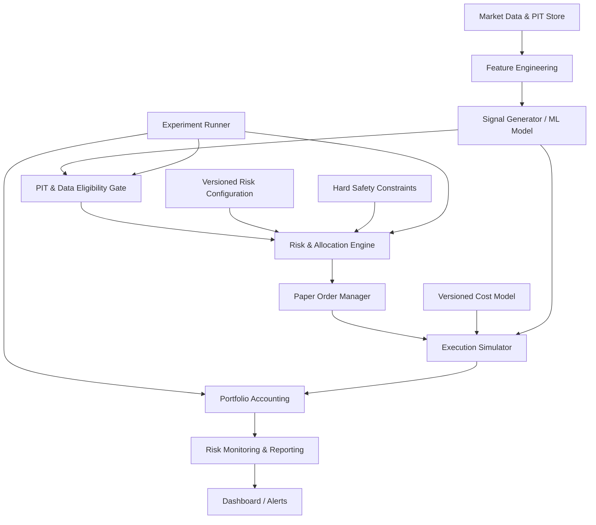
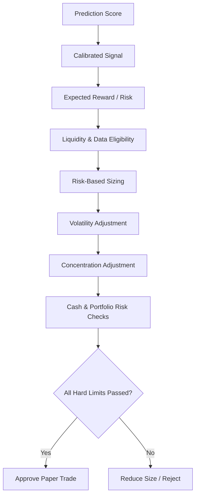
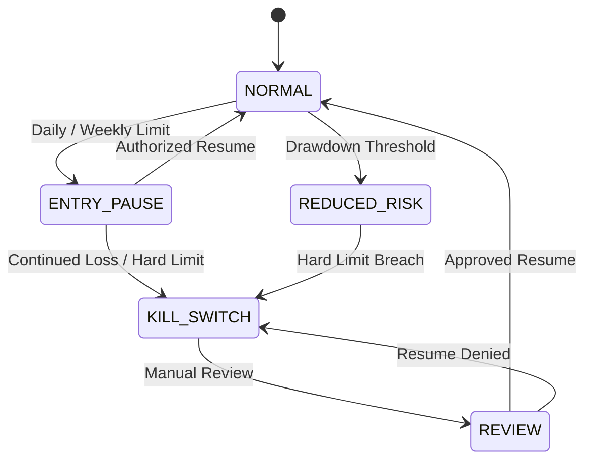
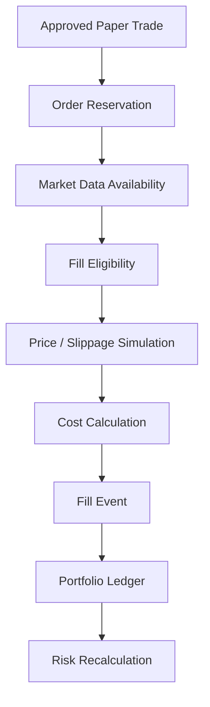
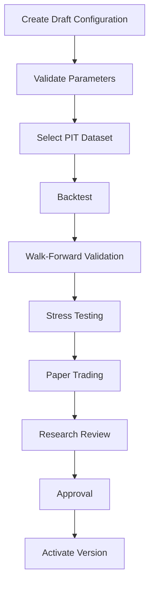
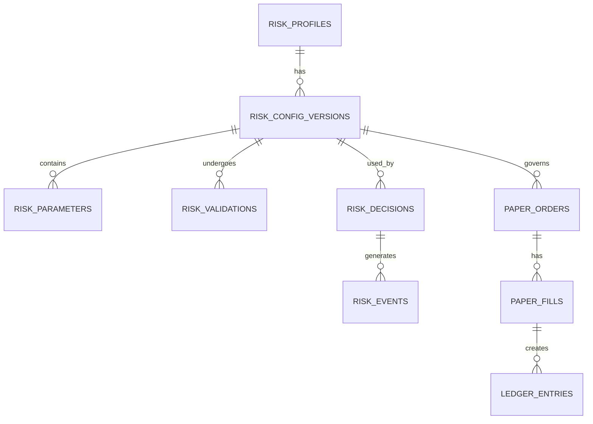

# Nivesh Risk Management & Capital Allocation Engine

## Complete Product Requirements Document (PRD)

`PRD v1.0` · `Paper Trading` · `Cash Equity` · `Long Only`

**Product:** Nivesh.ai / Nivesh Copilot

**Module:** Risk Management & Allocation Control Center

**Document status:** Proposed — for engineering and product review

**Primary objective:** Build a configurable, explainable, and auditable risk engine that converts stock signals into
controlled paper-trading allocations while protecting capital and preventing unrealistic performance claims.

This PRD covers the complete workflow we discussed: tunable UI parameters, position sizing, model-driven allocation,
drawdown controls, Zerodha cost simulation, paper-trading execution, backtesting, parameter experiments, and the
backend architecture.

The initial scope is **paper-only, cash-equity, long-only, positional trading**. It does not authorize live order
execution or change your underlying prediction model.

---

## 1. Executive Summary

### 1.1 Problem statement

Nivesh's stock prediction engine identifies potential price movements. However, a prediction does not automatically
determine:

- How much capital should be allocated.
- How much loss can be tolerated.
- Whether a stock is too concentrated in the portfolio.
- Whether the trade remains valid after brokerage and slippage.
- Whether the portfolio has reached a drawdown limit.
- Whether the strategy is robust outside its training period.

The platform needs a dedicated **Risk & Allocation Engine** between the signal generator and the paper-trading
execution simulator.

### 1.2 Product vision

> Convert predictive signals into risk-adjusted, portfolio-aware, cost-aware trading decisions with user-configurable
> parameters and non-bypassable safety constraints.

### 1.3 Design principles

| Principle | Requirement |
|---|---|
| Capital preservation | Control downside before optimizing returns |
| Explainability | Every allocation must have an auditable reason |
| Parameterization | User-tunable settings with validated bounds |
| Safety hierarchy | Hard risk limits override model conviction |
| Reproducibility | Every backtest uses a versioned configuration |
| Realism | Costs, slippage, liquidity, and gaps are simulated |
| No look-ahead | Only information available at decision time is used |
| Paper-first | No live execution in this scope |
| Human control | Configuration approval and kill switch remain explicit |

---

## 2. Scope

### 2.1 In scope

- Risk profile and configuration management
- Position sizing and capital allocation
- Stock, sector, portfolio and correlation limits
- Daily and cumulative drawdown controls
- Paper order and execution simulation
- Zerodha cost model with versioned rates
- Backtesting and walk-forward parameter experiments
- Audit trail, risk decisions, and configuration history
- Risk monitoring dashboard and alerts

### 2.2 Out of scope for v1

- Live broker order execution.
- Intraday leverage and derivatives.
- Short selling.
- Options and futures.
- Automatic capital transfers.
- Fully autonomous risk-profile changes.
- Guaranteed profit or return optimization.
- Unvalidated model retraining triggered by trading outcomes.

---

## 3. Target users and permissions

| User | Capabilities |
|---|---|
| Strategy Owner / Admin | Configure, approve, activate, and retire profiles |
| Quant / Researcher | Create experiments, backtest, compare metrics |
| Risk Reviewer | Review breaches, approve configuration changes |
| Paper Trader | Run simulations and view trade decisions |
| Viewer | Read-only portfolio and risk dashboards |

### Permission model

| State | Badge | Meaning |
|---|---|---|
| **Draft** | Editable | Researcher can modify settings and run validation. |
| **Validated** | Review | Backtest and walk-forward evidence is recorded. |
| **Approved** | Authorized | Authorized reviewer approves the version. |
| **Active** | In use | New paper simulations use the version according to its effective time. |
| **Retired** | Archived | Cannot be selected for new runs; historical results remain reproducible. |

**Requirement:** A user cannot activate a configuration merely by moving a UI slider.

---

## 4. High-level architecture

### 4.1 System flow

*(Diagram in the source PDF, reproduced as text.)*



### 4.2 Existing technology alignment

| Layer | Proposed implementation |
|---|---|
| Backend API | Python FastAPI |
| Database | PostgreSQL |
| Frontend | React 18 + Tailwind + Shadcn/UI |
| Charts | Recharts |
| Data | PIT OHLC, corporate actions, instrument master |
| Model | Existing Nivesh prediction engine |
| Execution | Paper order and fill simulator |
| Cost model | Versioned Zerodha delivery / transaction charges |
| Audit | PostgreSQL append-only decision records |
| Deployment | Existing Docker-based infrastructure |

### Critical dependency

The PIT (point-in-time) eligibility gate must execute before risk sizing. A model must not receive future
constituents, future fundamentals, revised historical data, or future corporate-action information during a
historical simulation.

---

## 5. Functional requirements

### FR-001: Risk profile management

The system shall allow authorized users to:

1. Create a risk profile.
2. Clone an existing profile.
3. Edit draft configurations.
4. Submit configurations for validation.
5. Approve and activate validated versions.
6. Retire an active profile.
7. Compare two or more configurations.
8. Restore a prior approved version for a new simulation.

### Risk profile fields

| Field | Description |
|---|---|
| Profile ID | Unique identifier |
| Name | Human-readable name |
| Strategy type | Cash equity, long only |
| Holding period | Positional |
| Capital basis | Fixed capital or selected portfolio |
| Currency | INR |
| Status | Draft, validated, approved, active, retired |
| Created by | User ID |
| Approved by | User ID |
| Effective from | Timestamp |
| Version | Immutable configuration version |

---

## 6. Configurable parameter specification

The following values are **proposed starting values for experimentation**, not empirically established optimal
settings.

### 6.1 Capital and risk controls

| Parameter | Key | Default | Suggested range |
|---|---|---|---|
| Trading capital | `capital_inr` | ₹5,00,000 | User input |
| Risk per trade | `risk_per_trade_pct` | 0.50% | 0.10–2.00% |
| Max portfolio open risk | `max_portfolio_risk_pct` | 5.00% | 1–10% |
| Max daily loss | `max_daily_loss_pct` | 2.00% | 0.5–5% |
| Max weekly loss | `max_weekly_loss_pct` | 4.00% | 1–10% |
| Minimum cash reserve | `min_cash_reserve_pct` | 20.00% | 5–50% |
| Max open positions | `max_open_positions` | 10 | 3–30 |
| Leverage | `leverage` | 0x | Fixed at 0x |

#### Hard validation rules

- `risk_per_trade_pct` must not exceed the configured hard maximum.
- Maximum daily loss must not exceed the maximum weekly loss unless an explicit policy permits it.
- Cash reserve must be nonnegative.
- Position count must be a positive integer.
- Leverage must remain zero in the initial scope.

The system should distinguish **user-configurable bounds** from **system-level immutable safeguards**.

### 6.2 Position and concentration controls

| Parameter | Key | Default |
|---|---|---|
| Maximum allocation per stock | `max_stock_allocation_pct` | 5% |
| Maximum sector allocation | `max_sector_allocation_pct` | 20% |
| Maximum total deployment | `max_deployed_capital_pct` | 80% |
| Maximum correlated exposure | `max_correlated_exposure_pct` | 30% |
| Maximum volume participation | `max_volume_participation_pct` | 5% |
| Minimum liquidity threshold | `min_liquidity_threshold` | Configurable |
| Averaging down | `allow_averaging_down` | False |

**Allocation cap vs risk cap:** A stock's market-value allocation limit does not replace the maximum permitted loss.
Both constraints must be applied.

### 6.3 Signal eligibility parameters

| Parameter | Key | Default |
|---|---|---|
| Minimum model score | `min_model_score` | Configurable |
| Minimum calibrated probability | `min_calibrated_probability` | Configurable |
| Minimum expected reward/risk | `min_reward_risk_ratio` | Configurable |
| Minimum price | `min_stock_price` | Configurable |
| Minimum average traded value | `min_avg_traded_value` | Configurable |
| Require valid stop-loss | `require_valid_stop` | True |
| Exclude stale data | `exclude_stale_data` | True |
| Exclude PIT violations | `exclude_pit_violations` | True |

The initial model should not rely on an uncalibrated probability as if it were a reliable probability of achieving a
target move. The probability must be assessed through out-of-sample calibration and monitoring.

### 6.4 Volatility and sizing parameters

| Parameter | Key | Default |
|---|---|---|
| Volatility sizing enabled | `volatility_adjustment_enabled` | True |
| ATR lookback | `atr_lookback_days` | 14 |
| Maximum stop distance | `max_stop_distance_pct` | Configurable |
| Minimum stop distance | `min_stop_distance_pct` | Configurable |
| Volatility size floor | `volatility_size_floor` | 0.25 |
| Volatility size ceiling | `volatility_size_ceiling` | 1.00 |
| Correlation adjustment | `correlation_adjustment_enabled` | True |

The defaults should be tested for stability rather than assumed to improve returns.

---

## 7. Position sizing engine

### 7.1 Objective

Calculate the maximum number of shares that can be purchased while respecting:

- Capital risk.
- Stop-loss distance.
- Maximum stock allocation.
- Sector allocation.
- Portfolio risk budget.
- Available cash.
- Liquidity.
- Execution costs.

### 7.2 Core formula

For a long position:

```text
Risk Amount         = Capital Base × Risk % / 100
Risk Per Share      = Entry Price − Stop Price
Risk-Based Quantity = floor( Risk Amount / (Risk Per Share + Cost Risk Per Share) )
```

A more complete model should include estimated slippage and adverse gap exposure.

### 7.3 Capital allocation constraints

```text
Q_final = min(Q_risk, Q_stock_cap, Q_sector_cap, Q_cash, Q_liquidity, Q_portfolio_risk)
```

If any required input is invalid, the trade should be rejected or marked for manual review rather than silently
assuming a value.

### 7.4 Example

| Input | Value |
|---|---|
| Capital | ₹5,00,000 |
| Risk per trade | 0.50% |
| Entry price | ₹500 |
| Stop-loss | ₹480 |
| Stock cap | 5% |
| Max risk | ₹2,500 |
| Risk per share | ₹20 |
| Risk-based quantity | 125 |
| Stock cap quantity | 50 |
| Final quantity before other constraints | 50 |

The stock allocation cap limits the position to ₹25,000, or 5% of capital, despite the risk-based calculation
permitting 125 shares.

**Important:** If the stop-loss is ₹480, the nominal loss from 50 shares is ₹1,000 before costs. A market gap below
the stop can create a larger realized loss.

---

## 8. Model-driven allocation

### 8.1 Principle

The model should propose a trade and an initial allocation score. The risk engine decides whether the trade is allowed
and how much can be allocated.

The model should not directly bypass risk controls because it predicts a high probability of a price move.

### 8.2 Proposed allocation process

*(Diagram in the source PDF, reproduced as text.)*



### 8.3 Allocation score

A configurable allocation score may combine:

| Factor | Role |
|---|---|
| Model confidence | Signal strength |
| Probability calibration | Reliability of probability estimate |
| Expected reward/risk | Trade payoff relative to loss |
| Volatility | Risk adjustment |
| Liquidity | Execution feasibility |
| Correlation | Portfolio diversification |
| Existing exposure | Concentration control |

**Do not assign arbitrary weights and interpret them as validated predictive performance.** The weighting scheme must
be evaluated through controlled experiments.

### 8.4 Model calibration requirement

Before using predicted probabilities for allocation:

- Generate predictions on unseen data.
- Compare predicted probabilities with realized event frequencies.
- Track calibration by probability bucket.
- Monitor performance drift across time and sectors.
- Store the model version with each trade decision.

---

## 9. Portfolio risk and allocation engine

### 9.1 Portfolio risk calculation

For each open position:

```text
Position Risk = Q × max(Entry − Stop, 0)
```

For the portfolio:

```text
Portfolio Open Risk = Σ Position Risk
```

This basic sum is conservative only in some contexts and does not fully capture correlation, gaps, or common-factor
risks. The engine should maintain both:

1. **Stop-based open risk.**
2. **Scenario/stress risk**, including correlated declines and gap events.

### 9.2 Concentration rules

The engine must check:

- Single-stock exposure.
- Sector exposure.
- Correlated exposure.
- Total deployed capital.
- Unallocated cash.
- Aggregate open risk.
- Pending orders and reservations.

#### Example

| Holding | Sector | Allocation |
|---|---|---|
| Stock A | Power | 5% |
| Stock B | Power | 5% |
| Stock C | Power | 5% |
| Stock D | Power | 5% |
| Total | Power | 20% |

The sector limit is met. A fifth power-sector stock cannot be added unless the existing exposure changes or the
configuration permits it.

---

## 10. Drawdown and kill-switch controls

### 10.1 Objectives

Protect the paper portfolio from uncontrolled accumulation of losses and make risk behavior measurable.

The drawdown controls are designed to stop **new exposure** or reduce permitted risk. They should not automatically
assume that all existing positions can be exited at the stop price.

### 10.2 Proposed state machine

*(Diagram in the source PDF, reproduced as text.)*



### 10.3 Risk states

| State | New entries | Existing positions | Required action |
|---|---|---|---|
| Normal | Allowed | Managed by strategy | Standard controls |
| Reduced risk | Reduced or blocked per policy | Continue with exit policy | Review exposure |
| Entry pause | Blocked | Continue under defined policy | Wait for authorization |
| Kill switch | Blocked | Separate liquidation/exit policy | Manual review |
| Recovery | Per approval | Defined exit policy | Validate conditions |

### 10.4 Drawdown calculations

#### Daily loss

```text
Daily Loss % = (Start-of-Day Equity − Current Equity) / Start-of-Day Equity × 100
```

The implementation must define whether unrealized P&L, fees, and open positions are included. I recommend including
realized and unrealized P&L plus simulated costs for risk monitoring, while separately reporting realized P&L.

#### Peak-to-trough drawdown

```text
Drawdown % = (Peak Equity − Current Equity) / Peak Equity × 100
```

The peak equity must be persisted and not reset merely because a configuration is changed.

---

## 11. Paper-trading execution simulator

### 11.1 Objective

Prevent unrealistic paper-trading results from producing false confidence in the strategy.

### 11.2 Execution flow

*(Diagram in the source PDF, reproduced as text.)*



### 11.3 Execution rules

| Rule | Requirement |
|---|---|
| Price source | Timestamped eligible market data |
| Fill model | Explicit configurable assumptions |
| Slippage | Included in simulation |
| Liquidity | Participation and volume checks |
| Partial fills | Supported |
| Unfilled orders | Remain pending or expire by policy |
| Gaps | Model adverse execution where applicable |
| Order reservations | Reduce available cash immediately |
| Costs | Calculate per fill/order |
| Audit | Preserve decision, order, and fill events |

### Preventing unrealistic fills

The system must not:

- Fill at a price that was unavailable in the selected data.
- Assume an intraday low or high was executable without a valid order model.
- Use closing price for a decision made after the close without accounting for timing.
- Ignore price gaps through stop-loss levels.
- Reuse future data in a historical simulation.

---

## 12. Zerodha cost engine

### 12.1 Objective

Simulate transaction costs for Indian equity paper trading using versioned assumptions.

The cost engine must support **delivery and intraday profiles**, with delivery initially used for the cash-equity
positional strategy.

The exact rates must be retrieved and maintained from authoritative Zerodha charge documentation and applicable
regulatory schedules. Charges are configurable and effective-dated; they should not be hardcoded permanently.

Reference: Zerodha Brokerage and Charges

### 12.2 Cost components

| Component | Requirement |
|---|---|
| Brokerage | Delivery/intraday profile |
| STT | Buy/sell rules by product |
| Exchange transaction charges | Exchange and applicable rates |
| SEBI turnover fees | Turnover-based |
| GST | Applicable taxable charge components |
| Stamp duty | State and transaction rules |
| DP charges | Separate delivery sell-side modeling if applicable |
| Slippage | Simulation parameter |
| Other applicable levies | Effective-dated configuration |

#### Delivery profile

For the initially proposed equity delivery strategy, brokerage is modeled as zero according to the earlier Zerodha cost
discussion. The system must still calculate applicable statutory and transaction charges.

Do not treat a paper estimate as a broker contract note. Actual charges must be reconciled against the authoritative
applicable schedule when real trading is considered.

### 12.3 Cost calculation

```text
turnover = buy_value + sell_value
brokerage = product_rule(turnover, order, product)
stt = applicable_stt_rule(buy_value, sell_value, product)
exchange_charges = turnover * exchange_rate
sebi_fee = turnover * sebi_rate
gst = applicable_tax_components * gst_rate
stamp_duty = applicable_buy_value * stamp_rate
dp_charge = applicable_delivery_sell_rule
total_cost = sum(all_cost_components)
```

Use decimal arithmetic and effective dates to avoid rounding errors and outdated rates.

### 12.4 Cost engine acceptance criteria

- Every simulated fill contains a cost breakdown.
- Cost rules have effective start dates.
- Rate changes create a new version.
- Backtests record the cost version.
- Cost estimates are separately labeled from actual broker-reported costs.
- The engine supports unit tests for rate calculations and rounding.

---

## 13. Risk management UI specification

### 13.1 Dashboard information architecture

*(Illustrative panel in the source PDF, reproduced as text.)*

| Risk & Allocation | `Paper` |
|---|---|
| Capital | ₹5,00,000 |
| Deployed | 55% |
| Open risk | ₹8,500 |
| Daily P&L | +₹1,240 |
| **Configuration** | |
| Risk per trade | 0.50% |
| Max stock allocation | 5% |
| Sector cap | 20% |
| Daily loss limit | 2% |
| **Controls** | |
| Kill switch | Ready |
| Averaging down | Disabled |
| Leverage | 0x |

*Illustrative UI composition, not a live trading dashboard.*

### 13.2 Screen structure

#### Screen 1 — Overview

Widgets:

- Capital and cash.
- Deployed capital.
- Open risk.
- Daily/weekly loss.
- Portfolio drawdown.
- Current risk state.
- Top concentration risks.
- Recent rejected trades.

#### Screen 2 — Risk Configuration

Sections:

1. Capital & risk.
2. Position limits.
3. Sector and correlation.
4. Volatility and sizing.
5. Execution costs.
6. Drawdown controls.
7. Advanced rules.

Controls:

- Slider for bounded numeric parameters.
- Numeric input for precise values.
- Dropdown for strategy types.
- Toggle for permitted features.
- Validation message.
- Default/reset option.
- Draft save.
- Change preview.

#### Screen 3 — Position Sizing

Inputs:

- Stock.
- Entry price.
- Stop-loss.
- Current portfolio exposure.
- Sector.
- Liquidity.
- Risk profile.

Outputs:

- Risk amount.
- Risk-based quantity.
- Stock-cap quantity.
- Sector-cap quantity.
- Final permitted quantity.
- Estimated position value.
- Estimated transaction costs.
- Rejection reasons.

#### Screen 4 — Experiment Lab

- Select configuration versions.
- Select historical date range.
- Choose PIT data snapshot.
- Run backtest.
- Run walk-forward.
- Compare experiments.
- Export results.
- Approve configuration for review.

#### Screen 5 — Risk Events

- Daily limit breaches.
- Portfolio drawdown breaches.
- Rejected allocation decisions.
- Kill-switch activation.
- Configuration changes.
- Resume approvals.

---

## 14. Detailed UI behavior

### 14.1 Slider behavior

Every tunable parameter should display:

- Current value.
- Minimum and maximum allowed value.
- Unit.
- Tooltip with definition.
- Validation state.
- Impact preview where feasible.
- Save as draft button.

Example:

| **Risk per trade** — Capital risk budget | **0.50%** |
|---|---|
| Slider range | 0.10% … 2.00% |
| Risk amount | ₹2,500 |

*Example for ₹5,00,000 capital. Production UI must calculate values from the selected configuration.*

### 14.2 Parameter change preview

When a user changes risk per trade:

**Display the impact on:**

- Risk amount per trade.
- Theoretical position size for sample trades.
- Maximum aggregate open risk.
- Potential exposure under the current portfolio.
- Whether the new setting exceeds approved bounds.

The preview must not change the active configuration until the user saves, validates, and activates an approved
version.

### 14.3 Configuration diff

Every change must show:

| Parameter | Old | New |
|---|---|---|
| Risk per trade | 0.50% | 0.75% |
| Stock allocation | 5% | 5% |
| Daily loss | 2% | 2% |

The user must confirm the change before submission for validation.

---

## 15. Backtesting and experiment framework

### 15.1 Objective

Identify how risk and allocation settings affect the strategy without overfitting to historical results.

### 15.2 Experiment workflow

*(Diagram in the source PDF, reproduced as text.)*



### 15.3 Required test modes

| Mode | Purpose |
|---|---|
| Historical backtest | Initial strategy behavior |
| Out-of-sample test | Unseen data evaluation |
| Walk-forward | Time-ordered revalidation |
| Monte Carlo | Assess variability of trade sequences |
| Gap stress | Simulate adverse overnight movement |
| Crash stress | Assess concentrated drawdowns |
| Slippage stress | Test cost sensitivity |
| Liquidity stress | Test fill feasibility |
| Parameter sensitivity | Assess robustness to changes |

### 15.4 Performance metrics

| Metric | Requirement |
|---|---|
| Net return after costs | Required |
| Maximum drawdown | Required |
| Sharpe ratio | Required |
| Profit factor | Required |
| Win rate | Required |
| Average win/loss | Required |
| Largest loss | Required |
| Longest losing streak | Required |
| Turnover | Required |
| Transaction costs | Required |
| Exposure utilization | Required |
| Calibration metrics | Required for probability-driven sizing |

#### Reporting restrictions

The experiment report must distinguish:

- In-sample results.
- Out-of-sample results.
- Paper trading results.
- Hypothetical backtest results.
- Costs included versus excluded.
- Data coverage and exclusions.
- Model and configuration versions.

No experiment may be described as validated merely because it produces a high historical return.

---

## 16. Database schema

The following is a proposed logical schema for PostgreSQL.

### 16.1 Entity relationship

*(Diagram in the source PDF, reproduced as text.)*



### 16.2 Tables

#### `risk_profiles`

| Column | Type |
|---|---|
| id | UUID PK |
| profile_name | VARCHAR |
| strategy_type | VARCHAR |
| status | VARCHAR |
| created_by | UUID |
| created_at | TIMESTAMPTZ |
| active_version_id | UUID nullable |

#### `risk_config_versions`

| Column | Type |
|---|---|
| id | UUID PK |
| profile_id | UUID FK |
| version_number | INTEGER |
| status | VARCHAR |
| capital_basis | NUMERIC |
| effective_from | TIMESTAMPTZ |
| created_by | UUID |
| approved_by | UUID nullable |
| approved_at | TIMESTAMPTZ nullable |
| config_hash | VARCHAR |
| created_at | TIMESTAMPTZ |

#### `risk_parameters`

| Column | Type |
|---|---|
| id | UUID PK |
| config_version_id | UUID FK |
| parameter_key | VARCHAR |
| value_numeric | NUMERIC nullable |
| value_boolean | BOOLEAN nullable |
| value_text | TEXT nullable |
| unit | VARCHAR |
| min_value | NUMERIC nullable |
| max_value | NUMERIC nullable |
| validation_status | VARCHAR |

#### `risk_decisions`

| Column | Type |
|---|---|
| id | UUID PK |
| simulation_id | UUID |
| signal_id | UUID |
| config_version_id | UUID |
| instrument_id | UUID |
| proposed_quantity | INTEGER |
| approved_quantity | INTEGER |
| entry_price | NUMERIC |
| stop_price | NUMERIC |
| risk_amount | NUMERIC |
| decision_status | VARCHAR |
| rejection_reason | TEXT |
| decision_timestamp | TIMESTAMPTZ |

#### `risk_events`

| Column | Type |
|---|---|
| id | UUID PK |
| simulation_id | UUID |
| event_type | VARCHAR |
| severity | VARCHAR |
| threshold_value | NUMERIC |
| observed_value | NUMERIC |
| state_before | VARCHAR |
| state_after | VARCHAR |
| created_at | TIMESTAMPTZ |
| acknowledged_by | UUID nullable |

#### Additional tables

- `paper_orders`
- `paper_fills`
- `portfolio_positions`
- `portfolio_ledger_entries`
- `cost_model_versions`
- `cost_model_components`
- `backtest_runs`
- `experiment_results`
- `configuration_approvals`
- `audit_log`

### 16.3 Database design requirements

- Use immutable configuration versions.
- Enforce foreign key integrity.
- Use numeric/decimal types for money and rates.
- Store timestamps in UTC with exchange-local trading dates where necessary.
- Preserve rejected risk decisions.
- Use database constraints for required fields.
- Ensure audit records cannot be silently overwritten.

---

## 17. API specification

### 17.1 Risk profile APIs

| Method | Endpoint | Purpose |
|---|---|---|
| POST | `/api/v1/risk/profiles` | Create profile |
| GET | `/api/v1/risk/profiles` | List profiles |
| GET | `/api/v1/risk/profiles/{id}` | Get profile |
| POST | `/api/v1/risk/profiles/{id}/clone` | Clone profile |
| POST | `/api/v1/risk/configurations` | Create version |
| PUT | `/api/v1/risk/configurations/{id}` | Edit draft |
| POST | `/api/v1/risk/configurations/{id}/validate` | Validate |
| POST | `/api/v1/risk/configurations/{id}/submit` | Submit review |
| POST | `/api/v1/risk/configurations/{id}/approve` | Approve |
| POST | `/api/v1/risk/configurations/{id}/activate` | Activate |
| POST | `/api/v1/risk/configurations/{id}/retire` | Retire |

### 17.2 Sizing APIs

| Method | Endpoint | Purpose |
|---|---|---|
| POST | `/api/v1/risk/size` | Calculate position size |
| POST | `/api/v1/risk/check` | Validate trade against risk rules |
| GET | `/api/v1/risk/portfolio` | Portfolio risk snapshot |
| GET | `/api/v1/risk/exposure` | Stock/sector exposure |
| GET | `/api/v1/risk/events` | Risk events |
| POST | `/api/v1/risk/kill-switch` | Activate paper-trading halt |
| POST | `/api/v1/risk/resume-review` | Submit resume request |

### 17.3 Example sizing request

```json
{
  "simulation_id": "sim-001",
  "instrument_id": "NSE:EXAMPLE",
  "entry_price": "500.00",
  "stop_price": "480.00",
  "signal_score": 0.82,
  "predicted_probability": 0.15,
  "sector": "Power",
  "available_cash": "500000.00",
  "config_version_id": "risk-v1"
}
```

### 17.4 Example sizing response

```json
{
  "decision_status": "APPROVED",
  "risk_based_quantity": 125,
  "stock_cap_quantity": 50,
  "sector_cap_quantity": 100,
  "final_quantity": 50,
  "position_value": "25000.00",
  "estimated_cost": "0.00",
  "rejection_reasons": [],
  "risk_config_version": "risk-v1"
}
```

The response above is illustrative. A production response must calculate actual cost and risk fields based on the
selected cost model and validated portfolio state.

---

## 18. Business rules

### BR-001: Hard limits

No allocation can exceed a hard risk or concentration limit.

### BR-002: Invalid stop-loss

A long trade with a stop-loss greater than or equal to the entry price must be rejected unless an explicitly supported
alternative risk policy exists.

### BR-003: Insufficient cash

A proposed allocation must not exceed available cash after reservations and required cash reserve.

### BR-004: Duplicate exposure

The engine must identify existing holdings and pending orders in the same instrument before calculating incremental
exposure.

### BR-005: Sector exposure

New exposure must be assessed against current positions and pending approved orders.

### BR-006: Daily loss threshold

When the configured daily threshold is breached, new entries must be blocked according to the active policy.

### BR-007: Configuration activation

Only approved and validated configuration versions may become active.

### BR-008: Kill switch

A kill switch must block new paper entries and create an auditable event. Any exit or liquidation behavior must be
governed by a separate documented policy.

### BR-009: Data integrity

A risk decision cannot be approved when mandatory price, stop, instrument, or portfolio inputs are missing or invalid.

### BR-010: PIT gate

A historical trade must be rejected or excluded if its input data violates the point-in-time eligibility rules.

---

## 19. Testing strategy

### 19.1 Unit testing

- Risk amount calculation.
- Quantity rounding.
- Position and sector caps.
- Cash reserve.
- Portfolio risk aggregation.
- Drawdown calculations.
- Cost component calculation.
- Parameter validation.
- Version status transitions.

### 19.2 Integration testing

- Signal → PIT gate → Risk Engine.
- Risk Engine → Paper Order Manager.
- Order Manager → Execution Simulator.
- Fill → Portfolio Ledger.
- Portfolio Ledger → Risk Monitoring.
- Configuration activation → New paper simulation.

### 19.3 Scenario testing

| Scenario | Expected behavior |
|---|---|
| Stop-loss invalid | Reject |
| Daily loss limit breached | Block new entries |
| Sector cap exceeded | Reduce/reject |
| No available cash | Reject |
| Missing price data | Reject |
| Duplicate pending order | Prevent duplicate exposure |
| Price gaps below stop | Apply gap/slippage policy |
| Liquidity insufficient | Reduce/reject |
| PIT violation | Exclude or reject |
| Configuration exceeds hard bound | Reject |
| Kill switch active | New entries blocked |
| Cost model version changes | Historical run remains reproducible |

### 19.4 Acceptance targets

Before moving to an operational paper-trading environment:

- All critical risk-rule unit tests pass.
- Integration tests verify risk controls cannot be bypassed through normal order flow.
- Backtests produce reproducible results with identical data and configuration versions.
- PIT validation tests cover future-data leakage cases.
- Execution simulation includes explicit cost and slippage assumptions.
- Drawdown and kill-switch transitions are audited.
- No live broker order submission is present in the v1 execution path.

---

## 20. Observability and auditability

### 20.1 Metrics

| Metric | Monitoring |
|---|---|
| Risk decisions per day | Volume |
| Rejection rate | Rule failures |
| Average approved allocation | Capital deployment |
| Open portfolio risk | Risk budget |
| Daily/weekly drawdown | Risk state |
| Cost as percentage of turnover | Execution efficiency |
| Slippage estimate | Simulation realism |
| Data/PIT rejection rate | Data integrity |
| Configuration changes | Governance |
| Paper fill rate | Execution quality |

### 20.2 Audit record

Every allocation decision should preserve:

```text
signal_id
model_version
feature_snapshot_id
risk_config_version
cost_model_version
portfolio_snapshot_id
input_prices
stop_loss
proposed_quantity
approved_quantity
risk_checks
rejection_reasons
decision_timestamp
```

The objective is to answer:

> Why did the system approve or reject this trade, using which data and which configuration?

---

## 21. Security and operational safeguards

### Requirements

- Role-based access to risk configuration changes.
- Authentication and authorization for API endpoints.
- No sensitive broker credentials in frontend state or logs.
- Audit log for configuration and kill-switch actions.
- Encryption in transit and at rest according to deployment standards.
- Secrets stored outside source code.
- Configuration change approval.
- Safe defaults for new profiles.
- No silent fallback to unsafe parameter values.
- Separate paper simulation environment from any future live execution infrastructure.

---

## 22. Implementation roadmap

| # | Phase | Scope |
|---|---|---|
| 1 | **Foundation** (Phase 1) | Risk configuration schema, versioning, parameter validation, sizing calculator, stock/sector caps, and API baseline. |
| 2 | **Risk engine integration** (Phase 2) | Connect existing signal generation to PIT gate, risk checks, paper orders, portfolio accounting, and audit logs. |
| 3 | **Execution realism** (Phase 3) | Versioned Zerodha cost engine, slippage, partial fills, liquidity constraints, and gap simulation. |
| 4 | **Drawdown and monitoring** (Phase 4) | State machine, loss thresholds, risk events, kill switch, and portfolio risk dashboard. |
| 5 | **Experiment lab** (Phase 5) | Backtest, walk-forward, Monte Carlo, stress testing, experiment comparison, and approval workflow. |

---

## 23. Definition of Done

The module is ready for initial paper-trading deployment when:

- [ ] Risk parameters can be configured and versioned through the UI.
- [ ] Hard limits are enforced by the backend, not only the frontend.
- [ ] Position sizing accounts for risk, stock cap, sector cap, and available cash.
- [ ] Portfolio risk is recalculated after fills and relevant market events.
- [ ] Drawdown state transitions work and are logged.
- [ ] Paper fills include documented cost and slippage assumptions.
- [ ] PIT validation is enforced in backtesting.
- [ ] No live order execution is accessible through v1.
- [ ] Every trade decision is auditable.
- [ ] Backtests are reproducible using configuration and cost model versions.
- [ ] Walk-forward and stress-testing reports are available.
- [ ] Critical tests pass.
- [ ] The risk engine can reject an otherwise high-scoring model signal.

---

## 24. Recommended initial configuration

Use this as a **baseline for controlled experiments**, not as a claim that these values maximize risk-adjusted returns.

**Baseline RISK-V1** · `Paper only`

| Setting | Value |
|---|---|
| Capital | ₹5,00,000 |
| Risk per trade | 0.50% |
| Max stock allocation | 5% |
| Max sector allocation | 20% |
| Max deployment | 80% |
| Max portfolio open risk | 5% |
| Daily loss threshold | 2% |
| Weekly loss threshold | 4% |
| Max open positions | 10 |
| Leverage | 0x |
| Averaging down | Disabled |
| Execution | Paper simulator |

---

## 25. Key product decisions to finalize

Before engineering implementation, these are the most important decisions that should be resolved through research or
explicit policy.

**Decision checklist**

*(The checklist box in the source PDF contains no items — the list did not render in the attachment. To be supplied
by the owner.)*
