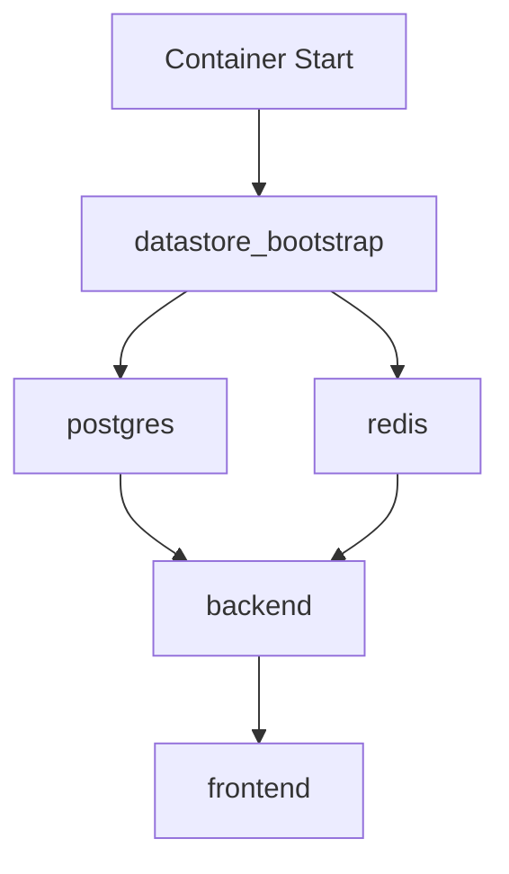

# Datastore Recovery System

## Problem Statement
On Kubernetes container restarts, system packages (PostgreSQL, Redis) and OS users get wiped, causing the application to lose database connectivity.

**Frequency**: This issue has occurred 5+ times across previous sessions.

## Solution
Automated recovery system that:
1. Auto-detects missing users/packages
2. Reinstalls and reconfigures datastores
3. Restores database connections
4. Verifies connectivity before resuming

## Files

### `/app/scripts/restore_datastores.sh`
Main recovery script that handles:
- System user creation (postgres, redis)
- Package installation (postgresql-15, redis-server)
- PostgreSQL data directory initialization
- Authentication configuration (trust for local connections)
- Database creation (nivesh)
- Service restart and verification

### `/etc/supervisor/conf.d/datastore_bootstrap.conf`
Supervisor configuration that runs the recovery script automatically on container startup with `priority=1` (runs before other services).

## Usage

### Manual Execution
```bash
# Run the recovery script
/app/scripts/restore_datastores.sh

# Check service status
sudo supervisorctl status
```

### Automatic Execution
The script runs automatically on container restart via supervisor (already configured).

### Force Recovery
```bash
# If services are down, manually trigger recovery
sudo supervisorctl stop postgres redis backend
/app/scripts/restore_datastores.sh
```

## What It Fixes

✅ **Missing OS Users**: Creates `postgres` and `redis` system users  
✅ **Missing Packages**: Installs PostgreSQL 15 and Redis  
✅ **Data Directory**: Initializes PG data directory if missing  
✅ **Authentication**: Configures pg_hba.conf for local trust auth  
✅ **Database**: Creates `nivesh` database if missing  
✅ **Connectivity**: Verifies PG and Redis connections work  
✅ **Backend Reconnection**: Restarts backend to reconnect to datastores

## Troubleshooting

### If PostgreSQL won't start:
```bash
# Check logs
sudo tail -50 /var/log/supervisor/postgres.err.log

# Manually test postgres binary
sudo -u postgres /usr/lib/postgresql/15/bin/postgres --version

# Re-run recovery
/app/scripts/restore_datastores.sh
```

### If Redis won't start:
```bash
# Check logs
sudo tail -50 /var/log/supervisor/redis.err.log

# Test redis binary
redis-server --version

# Re-run recovery
/app/scripts/restore_datastores.sh
```

### If Backend can't connect to PG:
```bash
# Check POSTGRES_URL secret in DB
curl -s "$API_URL/api/admin/secrets" \
  -H "Cookie: session_token=<ADMIN_TOKEN>" \
  | jq '.POSTGRES_URL'

# Should be: "postgresql://postgres@localhost:5432/nivesh"

# Update if needed via Admin UI or:
curl -X PUT "$API_URL/api/admin/secrets/POSTGRES_URL" \
  -H "Cookie: session_token=<ADMIN_TOKEN>" \
  -H "Content-Type: application/json" \
  -d '{"value":"postgresql://postgres@localhost:5432/nivesh"}'
```

## Environment Variables

The following secrets must be configured in MongoDB `system_config.secrets`:

- **POSTGRES_URL**: `postgresql://postgres@localhost:5432/nivesh`  
  *(Set via Admin UI → Secrets or `/api/admin/secrets/POSTGRES_URL`)*

## Service Dependencies



Priority order:
1. `datastore_bootstrap` (priority=1)
2. `postgres`, `redis` (priority=10)
3. `backend` (priority=20)
4. `frontend` (priority=30)

## Testing Recovery

```bash
# Simulate the issue by stopping services
sudo supervisorctl stop postgres redis

# Run recovery
/app/scripts/restore_datastores.sh

# Verify all services are up
sudo supervisorctl status

# Test DB connectivity
sudo -u postgres psql -d nivesh -c "SELECT version();"
redis-cli ping

# Test backend
curl http://localhost:8001/api/intelligence/portfolio
```

## Known Limitations

- **First-time setup**: If PG tables don't exist, you'll need to run migrations or seed scripts
- **Data persistence**: Data in PG/Redis will persist across restarts as long as `/var/lib/postgresql` and `/var/lib/redis` volumes are mounted
- **Network delays**: The script includes `sleep` commands; if services are slow to start, you may need to increase wait times

## Maintenance

### Update PostgreSQL version:
Edit `/app/scripts/restore_datastores.sh` and change:
```bash
postgresql-15  →  postgresql-16
```

### Add more datastores:
1. Add installation logic to `restore_datastores.sh`
2. Add supervisor config to `/etc/supervisor/conf.d/`
3. Update this README

## Related Files

- `/etc/supervisor/conf.d/nivesh_datastores.conf` - Main PG/Redis supervisor config
- `/var/log/supervisor/datastore_bootstrap.*.log` - Recovery script logs
- `/var/log/supervisor/postgres.*.log` - PostgreSQL logs
- `/var/log/supervisor/redis.*.log` - Redis logs
